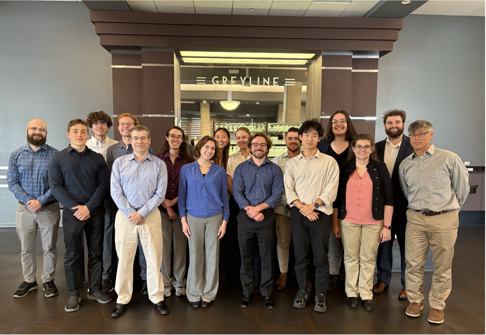

{width=100%}

::: {.small-centered}
Left to Right: Andrew Bennett, Roman Cortina, Jackson Sweet, George Fritze, Professor Adam Matzger, Julia Donovan, Evelyn Peterson, Josephine Ye, Yulia Rakova, Will Kidder, Nick Tomalia, Hochul Woo, Ashley Tubman, Dr. Lelia Foroughi, Ryan Hoffman, Dr. Antek Wong-Foy 
:::

## Welcome to the Matzger Lab!

Our research lies at the cutting edge, bridging materials chemistry with classic domains of chemistry such as organic synthesis and coordination chemistry. This interdisciplinary approach empowers us to synthesize polymers, explosives, and organized assemblies. By targeting unique compounds with novel methodologies, we aim to discover and characterize materials with groundbreaking properties. At the heart of our group, we are a crystallization lab that focuses on polymorphism, multicomponent crystallization, and the development of porous materials. See our research section for more information about specific projects in the lab.

## News and Announcements

::: {.news-box}

### January 2026 

We are excited to have a new rotator, Ethan Dixon. We are also glad to have undergraduate researchers Brandon Kauten and Sydney Miller. Welcome!

---

### September 2025
We're excited to have new rotators, Andrew Templeton and Tony Haskins. Glad to have you with us!

---

### July 2025 
Congratulations to Dr. Bennett on his successful defenfse!

---

### June 2025
Jackson Sweet has joined the group as a summer rotator-welcome!

---

### May 2025 
George and Ryan have officially joined the lab-welcome aboard! We're also excited to have a new rotator, Brian Quillin. Glad to have you with us!

---

### April 2025 
Congratulations to Dr. Nicolau on her successful defenfse!

---

### March 2025
Congratulations to Dr. Wright on his successful defenfse!

---

### January 2025
We're happy to have a new rotator: George Fritze.

---

### September 2024
We're happy to have new rotators: Gia River, Ryan Weiland, and Ryan Hoffman. Also, we are pleased to welcome new undergraduate researchers: Stefanie Swiecki, Ashley Tubman and Evelyn Peterson.

---

### May 2024
Congratulations to Dr. Robinson and Dr. Kelsall on thier successful defenfse!

---

### April 2024 
We're happy to have new rotators: Julia Donovan, and Cayden Dodd.

---

### January 2024 
We would like to congratulate Will Kiddler and Yulia Rakova for joining the lab. Also, we are glad to welcome Samuel Greco and Ally Tonsberg to the research rotation.

---

### September 2023
We're happy to have new rotators: Will Kidder, Erika Brown, Yulia Rakova, and Emily Holman. We would also like to welcome undergraduate student Zayd Uzzaman.

---

### May 2023
We would like to congratulate Nickolas Tomalia for joining the lab. Also, we are glad to welcome Lauren Meagher and George Hernandez to the summer research program.

---

:::

## Professor Matzger Contact Information 

**Phone** 734-615-6627

**Email:** matzger@umich.edu 

**Address** 2724 Chemistry, 930 N. University, Ann Arbor, Michigan 48109-1055

