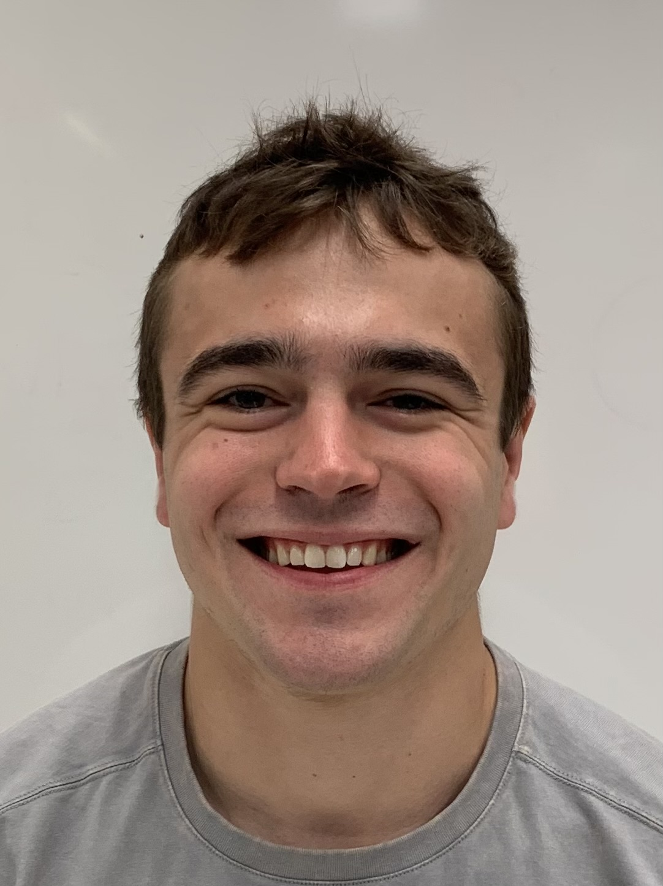
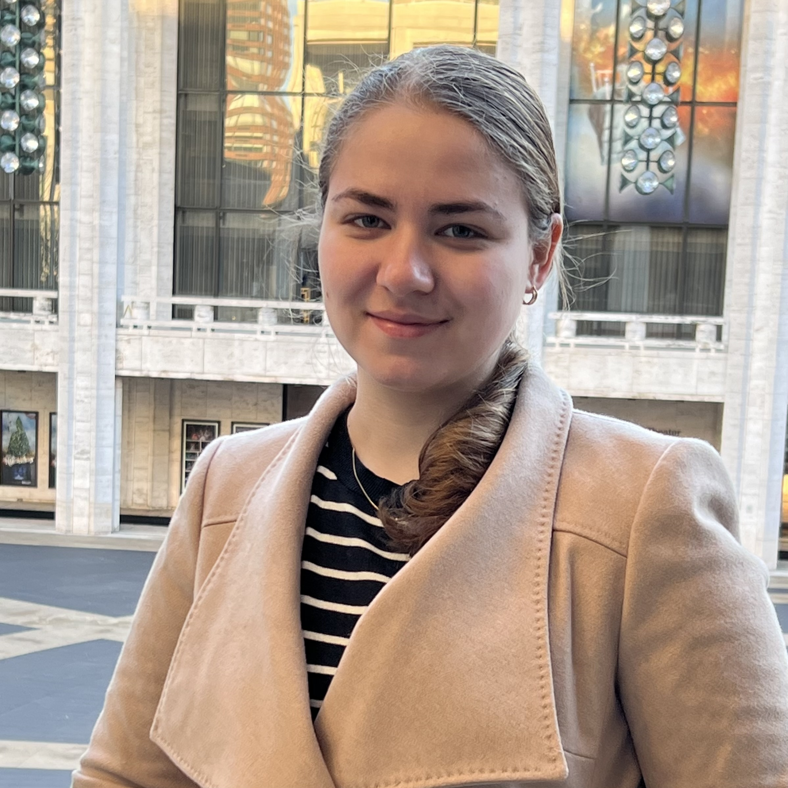
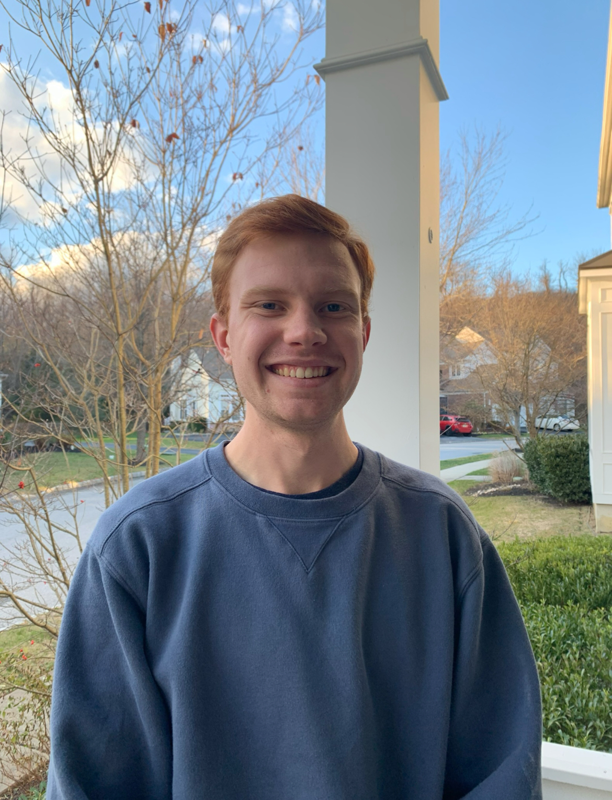
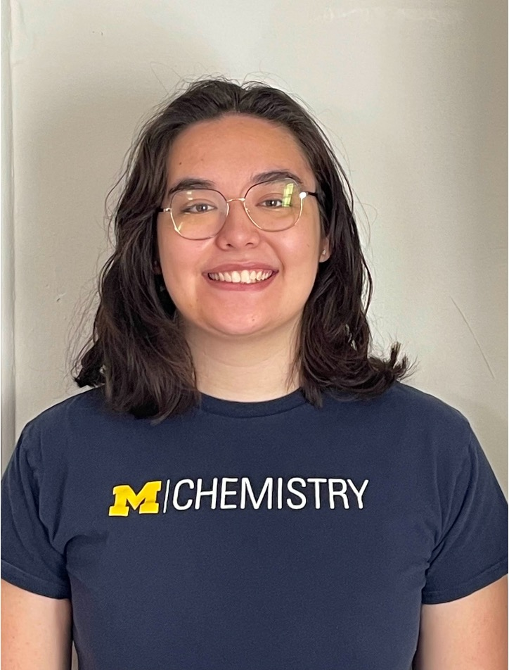
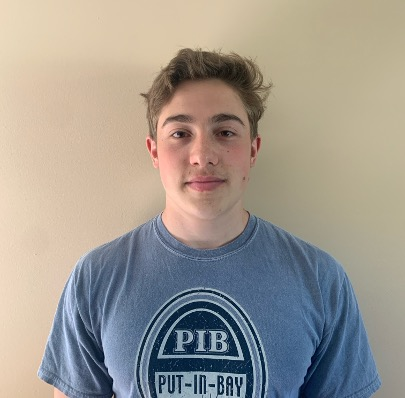
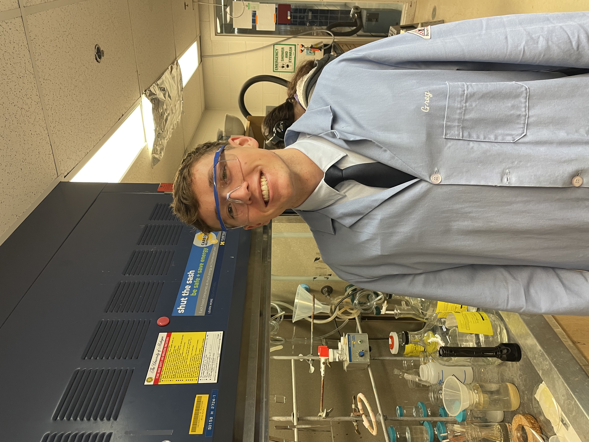

## People 

## Principle Investigator
::: {.columns}
::: {.columns width='30%'}
{width=70%}
:::
::: {.column width = "70%"}
 
**Dr. Adam J. Matzger** 

Professor of Chemistry and Macromolecular Science and Engineering

Ph.D. University of California-Berkeley
Organic; Polymers/Organic Materials

Introducion to Dr. Matzger: Dr. Matger studied x in grad school and y as a postdoc. 

Email: matzger@umich.edu

Office: Chem 2823

:::
:::

## Research Scientist 

::: {.headshot-grid}

::: {}

**Dr. Antek Wong-Foy**

Associate Research Scientist

B.S. University of Rochester

Ph.D. California Institute of Technology

Research Focus: 

Email: atkwong@umich.edu
:::

::: {}
{width=100%}

**Dr. Lelia Foroughi**

Research Associate

B.A. Bryn Mawr

Ph.D. Univesity of Michigan

Research Focus:

Email: foroug@umich.edu
:::

:::

## Graduate Students

::: {.headshot-grid}

::: {}
{width=100%}

**Hochul Woo**  
5th Year Ph.D. Student  
Macromolecular Science & Engineering  

**Projects:** Fundamental Understanding of MOFs  

**Background:** Hochul earned his M.S. and B.S. in chemistry from Kyungpook National University in South Korea, where his research previously focused on... Outside of lab, Hochul enjoys playing tennis and ...

Email: hcwoo@umich.edu
:::

::: {}
{width=100%}

**Nicholas Tomalia**  
4th Year Ph.D. Student  
Materials Chemistry  

**Projects:** Energetic MOF Composites  

**Previously:** Nick earned his B.S. in chemistry from Saginaw Valley State University.

Email: natomalia@umich.edu
:::

::: {}
{width=100%}

**Will Kidder**  
3rd Year Ph.D. Student  
Materials Chemistry  

**Projects:** Energetic MOF Composites and Fundamental MOF Research 

**Previously:** Will earned his B.S. in Chemistry from Alma College.

Email: wkidder@umich.edu
:::

::: {}
{width=100%}

**Yulia Rakova**  
3rd Year Ph.D. Student  
Organic Chemistry  

**Projects:** MOFs Drug Delivery  

**Previously:** Yulia earned her B.S. in Biochemistry from the University of Michigan.

Email: yrakova@umich.edu
:::

::: {}
{width=100%}
**Julia Donovan**  
3rd Year Ph.D. Student  
Organic Chemistry  

**Projects:** Fundamnetal MOF Synthesis  

**Previously:** Julia earned her B.S. in Chemistry from Emory University.

Email: jcdonov@umich.edu
:::

::: {}
{width=100%}
**Ryan Hoffman**  
2nd Year Ph.D. Student  
Materials Chemistry  

**Projects:** Energetic and Fundamental MOFs  

**Background:** Ryan earned her B.S. in Chemistry from the University of Maryland, Baltimore County (UMBC), where his research focused on synthesizing functionalized gold nanoparticles that would be used to develop a sensitive lead detection sensor. Outside of lab, Ryan enjoys playing basketball, weight lifting, and reading. 

Email: ryanhof@umich.edu
:::
::: {}
{width=100%}
**George Fritze**  
2nd Year Ph.D. Student  
Analytical Chemistry  

**Projects:** MOF Activation and Cocrystalization  

**Previously:** George earned her B.S. in Chemistry from the University of Pittsburgh.

Email: gfritze@umich.edu
:::
::: {}
{width=100%}
**Ethan Dixon**  
2nd Year Ph.D. Student  
Biochemistry Cluster 

**Projects:** Flexible and Energetic MOFs  

**Previously:** Ethan earned her B.S. in Chemistry from the University South Florida (USF).

Email: endixon@umich.edu
:::
:::

## Undergraduate Researchers 

::: {.headshot-grid}

::: {}
{width=100%}

### Evelyn Peterson 
University of Michigan

Chemistry, Senior 

**Project:** Fundamentals of MOF decomposition 

Email: evepet@umich.edu
:::

::: {}
{width=100%}

### Ashley Tubman 
University of Michigan

Chemistry, Senior 

**Project:** Energetic MOFs 

Email: ashtubman@umich.edu
:::

::: {}
{width=100%}

### Josephine Yeh 
University of Michigan

Chemistry, Senior 

**Project:** Chiral MOFs

Email: josieyeh@umich.edu
:::

::: {}
{width=100%}

### Haley Froberg
University of Michigan

Chemistry, Senior 

**Project:** Cocrystals

Email: hfroberg@umich.edu
:::

::: {}
{width=100%}

### Hans Roman Cortina: 
University of Michigan

Chemistry & Chemical Engineering, Junior 

**Project:** MOF Membranes and Spiropyran Polymers

Email: romancor@umich.edu
:::

::: {}
{width=100%}

### Zayd Uzzaman: 
University of Michigan

Data Science, Junior 

**Project:** Instrumentation Design and DFT Calculations

Email: zaydui@umich.edu
:::

::: {}
{width=100%}

### Kenneth Jiang: 
University of Michigan

Biomolecular Science, Junior 

**Project:** Kidney Stone Degredation

Email: jiangken@umich.edu
:::

::: {}
{width=100%}

### Brandon Kauten: 
University of Michigan

Chemistry, Junior 

**Project:** Energetic MOFs

Email: bkauten@umich.edu
:::

::: {}
{width=100%}

### Sydney Miller: 
University of Michigan

Chemistry, Sophmore 

**Project:** MOF Drug Delivery

Email: misydney@umich.edu
:::
:::

## Alumni 
### Name, (Ph.D. 2024)
Current Position: 

