## 2026

::: {.pub-grid}

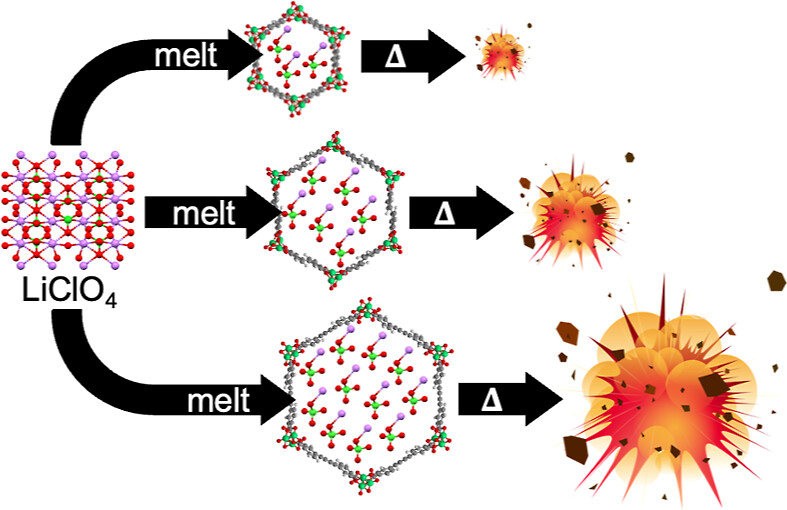

**236.** Tomalia, N. A.; Rakova, Y.; Tubman, A. N.; Matzger, A. J.  
"Tunable on-Demand Explosives Derived from Isoreticular Metal–Organic Framework Nanocomposites."  
*Chem. Mater.,* **2026**.  
[View Article](https://pubs.acs.org/doi/full/10.1021/acs.chemmater.5c03363)

:::

::: {.pub-grid}

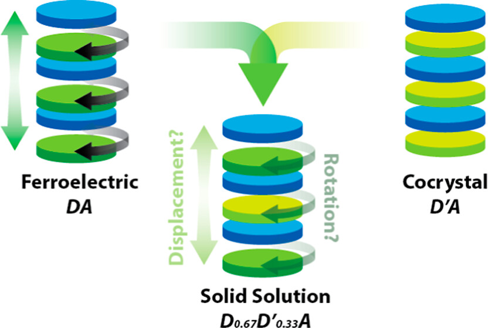

**235.** Wiscons, R. A.; Swendris, C. A. V.; Mendez, J. M.; Matzger, A. J.  
"Investigation of Phase Transitions in Molecular Solid Solutions Using an Organic Ferroelectric Model System."  
*Crystal Growth & Design.,* **2026**.  
[View Article](https://pubs.acs.org/doi/full/10.1021/acs.cgd.5c01253)

:::

::: {.pub-grid}

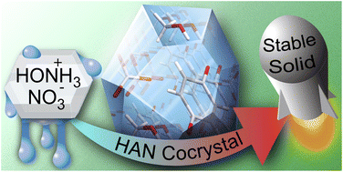

**234.** Bennett, A. J.; Froberg, H. R.; Bellas, M. K.; Foroughi, L. M.; Matzger, A. J.  
"Hydroxylammonium Nitrate: Synthesis, Cocrystals, and Properties."  
*J. Mater. Chem. A.,* **2026**.  
[View Article](https://pubs.rsc.org/en/content/articlelanding/2026/ta/d5ta08279j)

:::

## 2025

::: {.pub-grid}

**233.** Donovan, J. C.; Peterson, E. C.; Matzger, A. J.
"Transitioning Formamide Solvothermal Syntheses of MOFs to Less Toxic Solvents."
*Chem. Eur. J.,* **2025**
[View Article](https://chemistry-europe.onlinelibrary.wiley.com/doi/10.1002/chem.202503154?af=R)

:::

::: {.pub-grid}

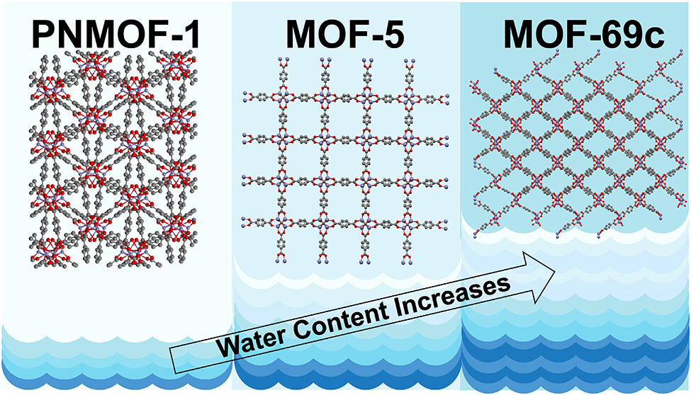

**232.** Donovan, J. C.; Peterson, E. C.; Matzger, A. J. 
"Phase Formation of Zinc Metal-Organic Frameworks under Low Water Concentrations."
*Crystal Growth & Design.,* **2025**
[View Article](https://pubs.acs.org/doi/full/10.1021/acs.cgd.5c01218)

:::

::: {.pub-grid}

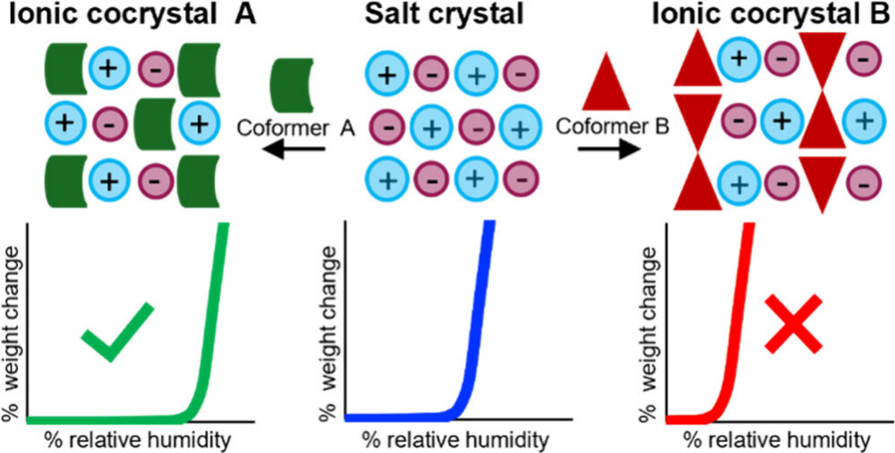

**231.** Foroughi, L. M.; Bennett, A. J.; Yeh, J. L.; Matzger, A. J 
"Hydroxylammonium Chloride Cocrystals: Structural and Hygroscopicity Trends."
*Crystal Growth & Design.,* **2025**
[View Article](https://pubs.acs.org/doi/full/10.1021/acs.cgd.5c00523)

:::

::: {.pub-grid}

**230.** Tomalia, N. A.; Matzger, A. J. 
"On-Demand Energetic Nanocomposites with Tunable Thermal Sensitivity from Porous Metal-Organic Frameworks." 
*ACS Materials Lett.,* **2025**
[View Article](https://pubs.acs.org/doi/full/10.1021/acsmaterialslett.5c00898)

:::

::: {.pub-grid}

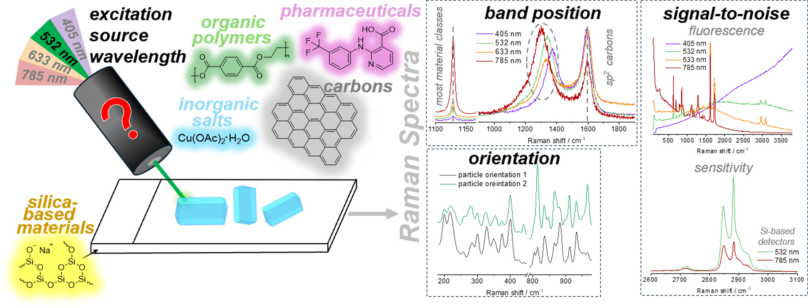

**229.** Nicolau, S. T.; Jiang, K. H.; Matzger, A. J. 
"Selecting a laser excitation source and sampling strategy for Raman spectroscopy." 
*Spectrochim. Acta A Mol. Biomol. Spectrosc.,* **2025**
[View Article](https://www.sciencedirect.com/science/article/pii/S1386142525008959)

:::
<!-- Started copying urls directly from website, not HTML file from here on out-->
::: {.pub-grid}

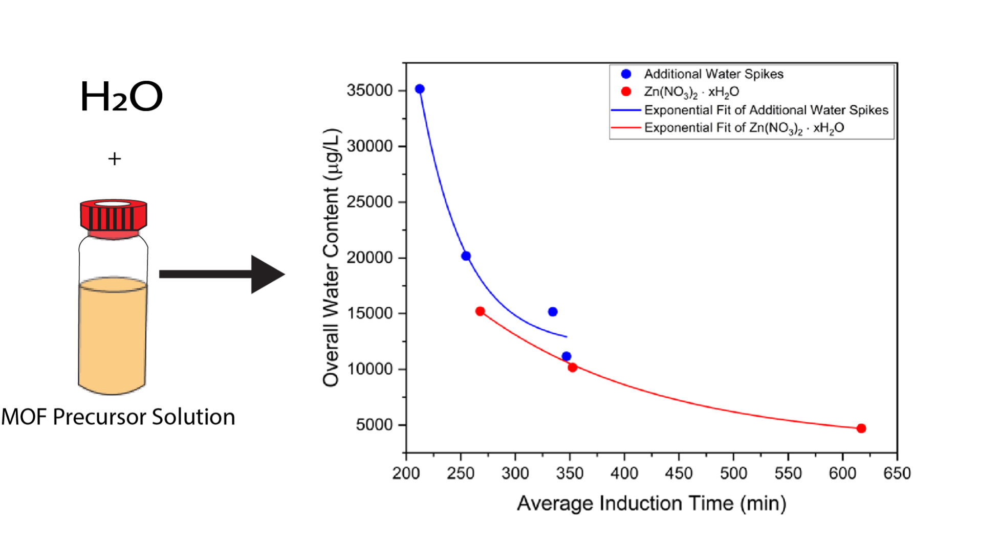

**228.** Wright, K. R.; Donovan, J. C.; Peterson, E. C.; Matzger, A. J.  
"Influence of Water on Zinc Metal-Organic Framework Formation Kinetics." 
*Crystal Growth & Design.,* **2025**
[View Article](https://pubs.acs.org/doi/full/10.1021/acs.cgd.5c00040)

:::

::: {.pub-grid}

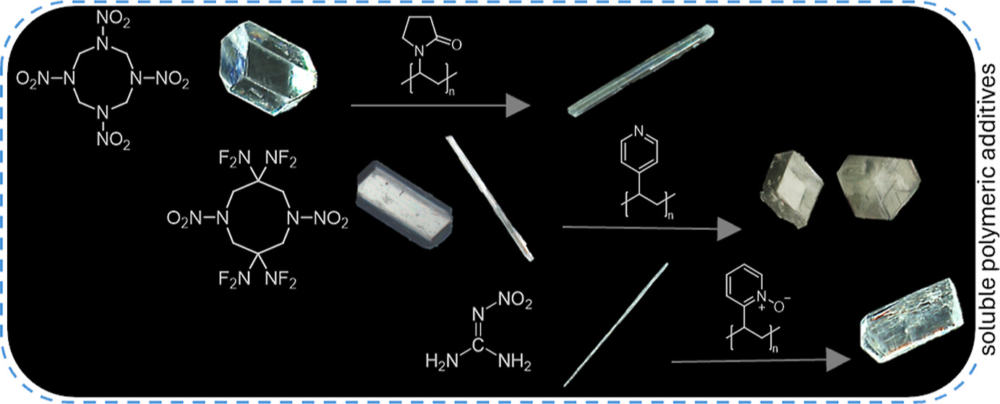

**227.** Nicolau, S. T.; Matzger, A. J.   
"Controlling Energetic Crystal Morphology Using Tailored Polymeric Additives." 
*Crystal Growth & Design.,* **2025**
[View Article](https://pubs.acs.org/doi/10.1021/acs.cgd.5c00049)

:::

::: {.pub-grid}

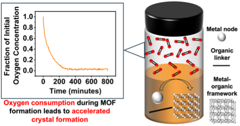

**226.** Donovan, J. C.; Wright, K. R.; Matzger, A. J.  
"Validation and Mechanistic Studies of the Headspace Effect in MOF Synthesis."
*Angew. Chem. Int. Ed.,* **2025**
[View Article](https://onlinelibrary.wiley.com/doi/10.1002/anie.202500531)

:::

::: {.pub-grid}

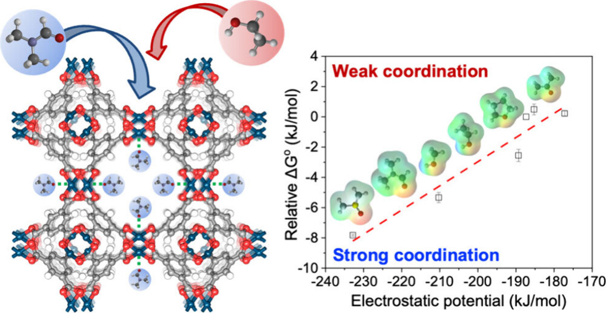

**225.** Woo, H.; Matzger, A. J. 
"Competitive Guest Binding in a Metal-Organic Framework with Coordinatively Unsaturated Metals." 
*ACS Materials Lett.,* **2025**
[View Article](https://pubs.acs.org/doi/full/10.1021/acsmaterialslett.4c02250)

:::

## 2024 

::: {.pub-grid}

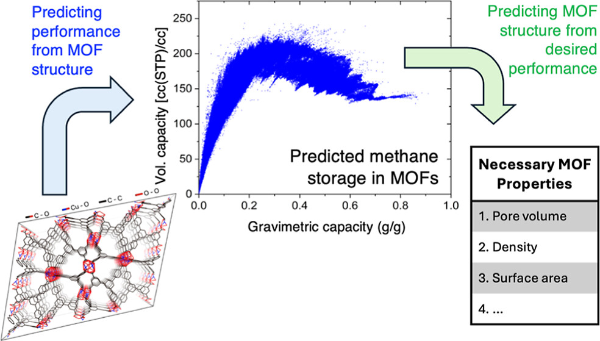

**224.** Ahmed, A.; Nath, K.; Matzger, A. J.; Siegel, D. J. 
"Machine Learning Predictions of Methane Storage in MOFs: Diverse Materials, Multiple Operating Conditions, and Reverse Models."
*ACS Appl. Mater. Interfaces.,* **2024**
[View Article](https://pubs.acs.org/doi/10.1021/acsami.4c10611)

:::

::: {.pub-grid}

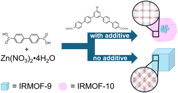

**223.** Carey, C. A.; Foroughi, L. M.; Matzger, A. J.  
"Designed additive suppresses interpenetration in IRMOF-10."
*Chem. Commun.,* **2024**
[View Article](https://pubs.rsc.org/en/content/articlelanding/2024/cc/d4cc03138e)

:::

::: {.pub-grid}

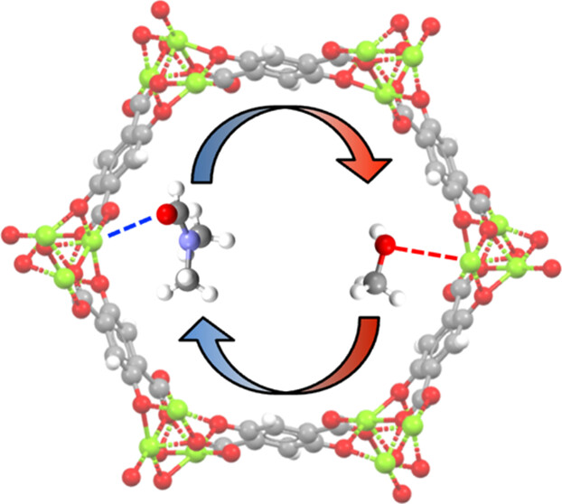

**222.** Woo, H. C.; Robinson, J. W.; Matzger, A. J.  
"Solvent Exchange Dynamics in M2(dobdc): An Interplay among Binding Strength, Exchange Kinetics, and Cooperativity."
*J. Am. Chem. Soc.,* **2024**
[View Article](https://pubs.acs.org/doi/10.1021/jacs.4c05355)

:::

::: {.pub-grid}

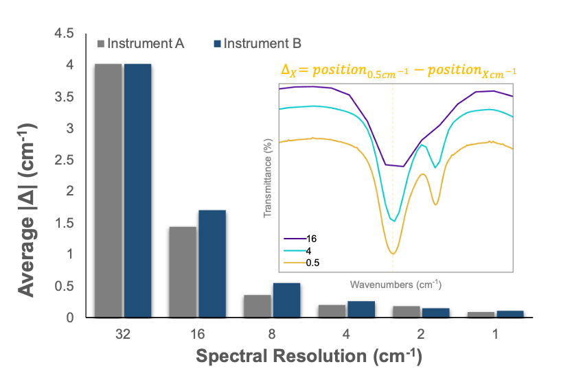

**221.** Nicolau, S. T.; Matzger, A. J
"An Evaluation of Resolution, Accuracy, and Precision in FT-IR Spectroscopy." 
*Spectrochim. Acta A Mol. Biomol. Spectrosc.,* **2024**
[View Article](https://www.sciencedirect.com/science/article/pii/S138614252400711X)

:::

::: {.pub-grid}

**220.**  Robinson, J. W.; Roberts, W. W.; Matzger, A. J.
"Kidney stone growth through the lens of Raman mapping."
*Sci. Rep.,* **2024**
[View Article](https://www.nature.com/articles/s41598-024-61652-9)

:::

::: {.pub-grid}

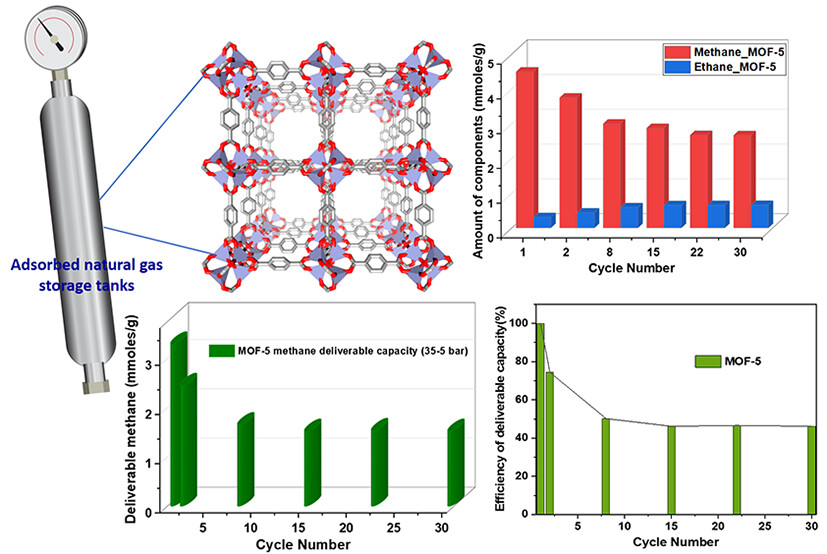

**219.** Nath, K. ; Wright K. R.; Ahmed A.; Siegel D. J.; Matzger, A. J.
"Adsorption of Natural Gas in Metal-Organic Frameworks: Selectivity, Cyclability, and Comparison to Methane Adsorption." 
*J. Am. Chem. Soc.,* **2024**
[View Article](https://pubs.acs.org/doi/full/10.1021/jacs.3c14535)

:::

::: {.pub-grid}

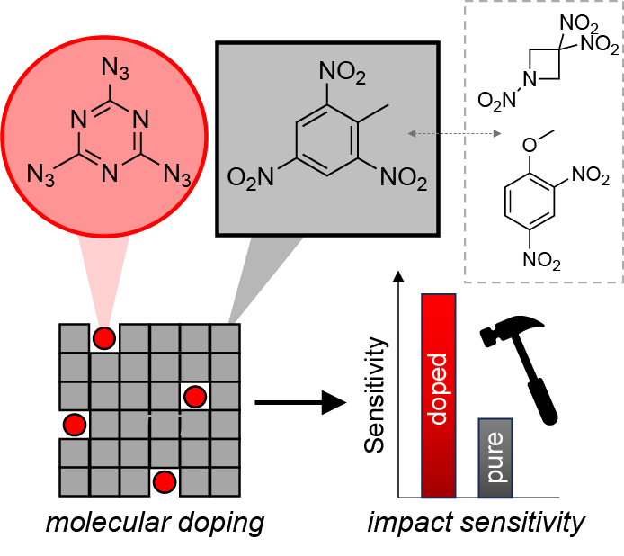

**218.** Nicolau, S. T.; Matzger, A. J.
"Sensitizing Explosives Through Molecular Doping." 
*ChemPlusChem,* **2024**
[View Article](https://chemistry-europe.onlinelibrary.wiley.com/doi/full/10.1002/cplu.202300724)

:::

::: {.pub-grid}

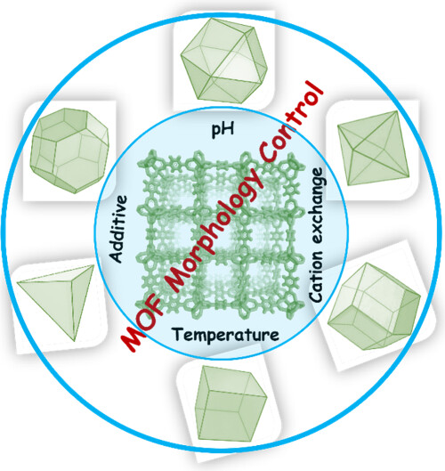

**217.** Suresh, K.; Carey, C. A.; Matzger, A. J. 
"Metal-Organic Frameworks (MOFs) Morphology Control: Recent Progress and Challenges."  
*Cryst. Growth Des.,* **2024**
[View Article](https://pubs.acs.org/doi/full/10.1021/acs.cgd.3c01339)

:::

::: {.pub-grid}

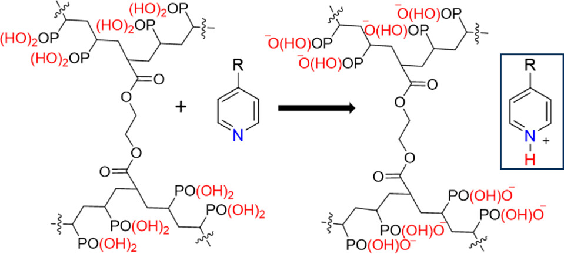

**216.** Kelsall, K. N.; Schubiner, R. O.; Schenck, L.; Frank, D. S.; Matzger, A. J. 
"Enhancing the Acidity of Polymers for Improved Stabilization of Amorphous Solid Dispersions: Protonation of Weakly Basic Compounds." 
*ACS Appl. Polym. Mater.,* **2024**
[View Article](https://pubs.acs.org/doi/full/10.1021/acsapm.3c02882)

:::

::: {.pub-grid}

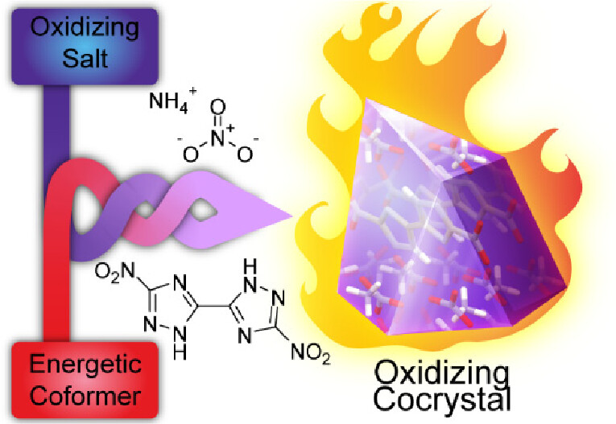

**215.** Bennett, A. J.; Foroughi, L. M.; Matzger, A. J.  
"Perchlorate-Free Energetic Oxidizers Enabled by Ionic Cocrystallization." 
*J. Am. Chem. Soc.,* **2024**
[View Article](https://pubs.acs.org/doi/10.1021/jacs.3c12023)

:::

::: {.pub-grid}

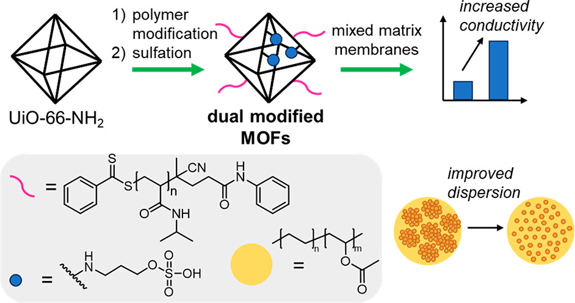

**214.** Carey, C. A.; Devlin, A. M.; Matzger, A. J.  
"Dual Modification of MOFs Improves Dispersion and Ionic Conductivity of Mixed Matrix Membranes."
*ACS Materials Lett.,* **2024**
[View Article](https://pubs.acs.org/doi/10.1021/acsmaterialslett.3c01304)

:::

## 2023

**213.** Robinson, J. W.; Marom, R.; Ghani, K. R.; Roberts, W. W.; Matzger, A. J. "Performance of Brushite Plaster as Kidney Stone Phantoms for Laser Lithotripsy." *Urolithiasis.* **2023**  
[View Article](https://link.springer.com/article/10.1007/s00240-023-01505-8)

**212.** Bramlett, T. A.; Foroughi, L. M.; Matzger, A. J. "Establishing the Analogy between Hydrates and Peroxosolvates: Cambridge Structural Database Analysis of Pyridyl Hydrates Yields New Peroxosolvates." *Cryst. Growth Des.* **2023**  
[View Article](https://pubs.acs.org/doi/full/10.1021/acs.cgd.3c00009)

**211.** Woo, H.; Devlin, A. M.; Matzger, A. J. "In Situ Observation of Solvent Exchange Kinetics in a MOF with Coordinatively Unsaturated Sites." *J. Am. Chem. Soc.* **2023**  
[View Article](https://pubs.acs.org/doi/full/10.1021/jacs.3c06396)

**210.** Bennett, A. J.; Matzger, A. J. "Progress in Predicting Ionic Cocrystal Formation: The Case of Ammonium Nitrate." *Chem. Eur. J.* **2023**  
[View Article](https://chemistry-europe.onlinelibrary.wiley.com/doi/10.1002/chem.202300076)

**209.** Robinson, J. W.; Ghani, K. R.; Roberts, W. W.; Matzger, A. J. "Near-Infrared Absorption Coefficients in Kidney Stone Minerals and Their Relation to Crystal Structure." *J. Phys. Chem. C.* **2023**  
[View Article](https://pubs.acs.org/doi/full/10.1021/acs.jpcc.2c07475)

**208.** Kelsall, K. N.; Foroughi, L. M.; Frank, D. S.; Schenck, L.; LaBuda, A.; Matzger, A. J. "Structural Modifications of Polyethylenimine to Control Drug Loading and Release Characteristics of Amorphous Solid Dispersions." *Mol. Pharmaceutics.* **2023**  
[View Article](https://pubs.acs.org/doi/10.1021/acs.molpharmaceut.2c00970?ref=pdf)

## 2022

**207.** Wright, K. R.; Nath, K.; Matzger, A. J. "Superior Metal-Organic Framework Activation with Dimethyl Ether." *Angew. Chem.* **2022**  
[View Article](https://onlinelibrary.wiley.com/doi/10.1002/anie.202213190)

**206.** Nath, K.; Ahmed, A.; Siegal, D. J.; Matzger, A. J. "Microscale Determination of Binary Gas Adsorption Isotherms in MOFs." *J. Am. Chem. Soc.* **2022**  
[View Article](https://pubs.acs.org/doi/full/10.1021/jacs.2c09818)

**205.** Du Bois, D. R.; Matzger, A. J. "Metal-Organic Framework Seeding to Drive Phase Selection and Overcome Synthesis Limitations." *Cryst. Growth Des.* **2022**  
[View Article](https://pubs.acs.org/doi/10.1021/acs.cgd.2c00762)

**204.** Bellas, M. K.; Matzger, A. J. "Discovery Strategy Leads to the First Melt-Castable Cocrystal Based on an Energetic Oxidizing Salt." *Chem. Sci.* **2022**  
[View Article](https://pubs.rsc.org/en/content/articlelanding/2022/sc/d2sc03015b)

**203.** Bellas, M. K.; Matzger, A. J. "Peroxosolvate Discovery Method Leads to First Cocrystal with Three Energetic Components." *Chem. Commun.* **2022**  
[View Article](https://pubs.rsc.org/en/content/articlelanding/2022/cc/d2cc02024f)

**202.** Sotuyo, A.; Swendris, C. A. V.; Suresh, K.; Matzger, A. J. "The Role of Secondary Interactions in Centrosymmetric Charge Transfer Complexes with Nitrated Acceptors." *Cryst. Growth Des.* **2022**  
[View Article](https://pubs.acs.org/doi/full/10.1021/acs.cgd.2c00147)

**201.** Wiscons, R. A.; Nikhar, R.; Szalewicz, K.; Matzger, A. J. "Factors Influencing Hydrogen Peroxide versus Water Inclusion in Molecular Crystals." *Phys. Chem. Chem. Phys.* **2022**  
[View Article](https://pubs.rsc.org/en/Content/ArticleLanding/2022/CP/D1CP05765K)

**200.** Nath, K.; Ahmed, A.; Siegel, D. J.; Matzger, A. J. "Computational Identification and Experimental Demonstration of High-Performance Methane Sorbents." *Angew. Chem.* **2022**  
[View Article](https://onlinelibrary.wiley.com/doi/full/10.1002/anie.202203575)

**199.** Shalini, S.; Matzger, A. J. "Ethylene Oxide Functionalization Enhances the Ionic Conductivity of a MOF." *Chem. Commun.* **2022**  
[View Article](https://pubs.rsc.org/en/Content/ArticleLanding/2022/CC/D2CC01286C)

**198.** Du Bois, D. R.; Wright, K. R.; Bellas, M. K.; Wiesner, N.; Matzger, A. J. "Linker Deprotonation and Structural Evolution on the Pathway to MOF-74." *Inorg. Chem.* **2022**  
[View Article](https://pubs.acs.org/doi/abs/10.1021/acs.inorgchem.1c03988)

**197.** Suresh, K.; Kalenak, A. P.; Sotuyo, A.; Matzger, A. J. "Metal-Organic Framework (MOF) Morphology Control by Design." *Chem. Eur. J.* **2022**  
[View Article](https://chemistry-europe.onlinelibrary.wiley.com/doi/10.1002/chem.202200334)

## 2021

**196.** Bramlett, T. A.; Matzger, A. J. "Halogen Bonding Propensity in Solution: Direct Observation and Computational Prediction." *Chem. Eur. J.* **2021**  
[View Article](https://chemistry-europe.onlinelibrary.wiley.com/doi/10.1002/chem.202102522)

**195.** Foroughi, L. M.; Matzger, A. J. "From Hydrate to Peroxosolvate: A Test of Prediction with Cyclic *N*-Oxides." *Cryst. Growth Des.* **2021**  
[View Article](https://pubs.acs.org/doi/10.1021/acs.cgd.1c00746)

**194.** Suresh, K.; Aulakh, D.; Purewal, J.; Siegal, D. J.; Veenstra, M.; Matzger, A. J. "Optimizing Hydrogen Storage in MOFs through Engineering of Crystal Morphology and Control of Crystal Size." *J. Am. Chem. Soc.* **2021**  
[View Article](https://pubs.acs.org/doi/pdf/10.1021/jacs.1c04926)

**193.** Bellas, M. K.; Mackenzie, L. V.; Matzger, A. J. "Lamellar Architecture Affords Salt Cocrystals with Tunable Stoichiometry." *Cryst. Growth Des.* **2021**  
[View Article](https://pubs.acs.org/doi/10.1021/acs.cgd.1c00302)

**192.** Bennion, J. C.; Matzger, A. J. "Development and Evolution of Energetic Cocrystals." *Acc. Chem. Res.* **2021**  
[View Article](https://pubs.acs.org/doi/full/10.1021/acs.accounts.0c00830)

**191.** Du Bois, D. R.; Matzger, A. J. "Reagent Reactivity and Solvent Choice Determine Metal-Organic Framework Microstructure during Postsynthetic Modification." *J. Am. Chem. Soc.* **2021**  
[View Article](https://pubs.acs.org/doi/10.1021/jacs.0c12040)

## 2020

**190.** Dodson, R. A.; Kalenak, A. P.; Matzger, A. J. "Solvent Choice in Metal-Organic Framework Linker Exchange Permits Microstructural Control." *J. Am. Chem. Soc.* **2020**  
[View Article](https://pubs.acs.org/doi/10.1021/jacs.0c10224)

**189.** Shalini, S.; Frank, D. S.; Aldoukhi, A. H.; Majdalany, S. E.; Roberts, W. W.; Ghani, K. R.; Matzger, A. J. "Assessing the Role of Light Absorption in Laser Lithotripsy by Isotopic Substitution of Kidney Stone Materials." *ACS Biomater. Sci. Eng.* **2020**  
[View Article](https://doi.org/10.1021/acsbiomaterials.0c00790)

**188.** Dodson, R. A.; Kalenak, A. P.; Du Bois, D. R.; Gill-Ljunghammer, S. L.; Matzger, A. J. "*N,N*-Diethyl-3-methylbenzamide (DEET) Acts as a Metal-Organic Framework Synthesis Solvent with Phase-Directing Capabilities." *Chem. Commun.* **2020**  
[View Article](https://pubs.rsc.org/en/content/articlelanding/2020/cc/d0cc02741c)

**187.** Suresh, K.; López-Mejías, V.; Roy, S.; Camacho, D. F.; Matzger, A. J. "Leveraging Framework Instability: A Journey from Energy Storage to Drug Delivery." *Synlett.* **2020**  
[View Article](https://www.thieme-connect.com/products/ejournals/abstract/10.1055/s-0040-1707139)

**186.** Shalini, S.; Vaid, T. P.; Matzger, A. J. "Salt Nanoconfinement in Zirconium-Based Metal-Organic Frameworks Leads to Pore-Size- and Loading-Dependent Ionic Conductivity Enhancement." *Chem. Commun.* **2020**  
[View Article](https://pubs.rsc.org/en/content/articlelanding/2020/cc/d0cc03147j)

**185.** Foroughi, L. M.; Wiscons, R. A.; Du Bois, D. R.; Matzger, A. J. "Improving Stability of the Metal-Free Primary Energetic Cyanuric Triazide (CTA) through Cocrystallization." *Chem. Commun.* **2020**  
[View Article](https://pubs.rsc.org/en/content/articlelanding/2020/CC/C9CC09465B)

## 2019

**184.** Wiscons, R. A.; Matzger, A. J. "Utilizing plane group symmetry to favor noncentrosymmetry in three-dimensional crystals." *Can. J. Chem.*, **2019**  
[View Article](https://cdnsciencepub.com/doi/10.1139/cjc-2019-0402)

**183.** Dasari, R. R.; Wang, X.; Wiscons, R. A.; Haneef, H. F.; Ashokan, A.; Zhang, Y.; Fonari, M. S.; Barlow, S.; Coropceanu, V.; Timofeeva, T. V.; Jurchescu, O. D.; Brédas, J.-L.; Matzger, A. J. "Charge-Transport Properties of F6TNAP-Based Charge-Transfer Cocrystals." *Adv. Funct. Mater.*, **2019**  
[View Article](https://onlinelibrary.wiley.com/doi/abs/10.1002/adfm.201904858)

**182.** Suresh, K.; Matzger, A. J. "Enhanced Drug Delivery by Dissolution of Amorphous Drug Encapsulated in a Water Unstable Metal-Organic Framework." *Angew. Chem.*, **2019**  
[View Article](https://onlinelibrary.wiley.com/doi/full/10.1002/anie.201907652)

**181.** Bellas, M. K.; Matzger, A. J. "Achieving Balanced Energetics Through Cocrystallization." *Angew. Chem.*, **2019**  
[View Article](https://onlinelibrary.wiley.com/doi/abs/10.1002/anie.201908709)

**180.** Frank, D. S.; Aldoukhi, A. H.; Roberts, W. W.; Ghani, K. R.; Matzger, A. J. "Polymer-Mineral Composites Mimic Human Kidney Stones in Laser Lithotripsy Experiments." *ACS Biomater. Sci. Eng.*, **2019**  
[View Article](https://pubs.acs.org/doi/10.1021/acsbiomaterials.9b01130)

**179.** Seth, S.; Vaid, T. P.; Matzger, A. J. "Salt loading in MOFs: solvent-free and solvent-assisted loading of NH4NO3 and LiNO3 in UiO-66." *Dalton Trans.*, **2019**  
[View Article](https://pubs.rsc.org/en/content/articlepdf/2019/dt/c9dt02489a)

**178.** Dodson, R. A.; Matzger, A. J. "Resolvation-Based Damage to Metal-Organic Frameworks and Approaches to Mitigation." *ACS Mater. Lett.*, **2019**  
[View Article](https://pubs.acs.org/doi/10.1021/acsmaterialslett.9b00240)

**177.** Frank, D. S.; Zhu, Q.; Matzger, A. J. "Inhibiting or Accelerating Crystallization of Pharmaceuticals by Manipulating Polymer Solubility." *Mol. Pharmaceutics*, **2019**  
[View Article](https://pubs.acs.org/doi/pdf/10.1021/acs.molpharmaceut.9b00468)

**176.** Kent, R. V.; Vaid, T. P.; Boissonnault, J. A.; Matzger, A. J. "Adsorption of tetranitromethane in zeolitic imidazolate frameworks yields energetic materials." *Dalton Trans.*, **2019**  
[View Article](https://pubs.rsc.org/en/content/articlepdf/2019/dt/c9dt01254k)

**175.** Ahmed, A.; Seth, S.; Purewal, J.; Wong-Foy, A. G.; Veenstra, M.; Matzger, A. J.; Seigel, D. J. "Exceptional hydrogen storage achieved by screening nearly half a million metal-organic frameworks." *Nat. Commun.*, **2019**  
[View Article](https://www.nature.com/articles/s41467-019-09365-w.pdf)

**174.** Wiscons, R. A.; Coropceanu, V.; Matzger, A. J. "Quaternary charge-transfer solid solutions: electronic tunability through stoichiometry." *Chem. Mater.*, **2019**  
[View Article](https://pubs.acs.org/doi/pdf/10.1021/acs.chemmater.9b00502)

**173.** Vuppuluri, V. S.; Bennion, J. C.; Wiscons, R. A.; Gunduz, I. E.; Matzger, A. J.; Son, S. F. "Detonation Velocity Measurement of a Hydrogen Peroxide Solvate of CL-20." *Propellants Explos. Pyrotech.*, **2019**  
[View Article](https://onlinelibrary.wiley.com/doi/epdf/10.1002/prep.201800202)

**172.** Frank, D. S.; Matzger, A. J. "Effect of Polymer Hydrophobicity on the Stability of Amorphous Solid Dispersions and Supersaturated Solutions of a Hydrophobic Pharmaceutical." *Mol. Pharmaceutics*, **2019**  
[View Article](https://pubs.acs.org/doi/pdf/10.1021/acs.molpharmaceut.8b00972)

**171.** Nguyen-Sorenson, A. H. T.; Anderson, C. A.; Balijepalli, S. K.; McDonald, K. A.; Matzger, A. J.; Stowers, K. J. "Highly active copper catalyst obtained through rapid MOF decomposition." *Inorg. Chem. Front.*, **2019**  
[View Article](https://pubs.rsc.org/en/content/articlepdf/2019/qi/c8qi01217b)

## 2018

**171.** Suresh, K.; Ashe, J. S.; Matzger, A. J. "Far-Infrared Spectroscopy as A Probe for Polymorph Discrimination." *J. Pharm. Sci.*, **2018**  
[View Article](https://jpharmsci.org/article/S0022-3549(18)30819-0/pdf)

**170.** Matzger, A. J. "Author Profile." *Angewandte Chemie*, **2018**  
[View Article](https://onlinelibrary.wiley.com/doi/pdf/10.1002/anie.201812101)

**169.** Wiscons, R. A.; Bellas, M. K.; Bennion, J. C.; Matzger, A. J. "Detonation Performance of Ten Forms of 5,5'-Dinitro-2H,2H'-3,3'-bi-1,2,4-triazole (DNBT)." *Cryst. Growth Des.*, **2018**  
[View Article](https://pubs.acs.org/doi/pdf/10.1021/acs.cgd.8b01583)

**168.** Dodson, R. A.; Wong-Foy, A. G.; Matzger, A. J. "The Metal-Organic Framework Collapse Continuum: Insights from Two-Dimensional Powder X-ray Diffraction." *Chem. Mater.*, **2018**  
[View Article](https://pubs.acs.org/doi/10.1021/acs.chemmater.8b03378)

**167.** Kersten, K. M.; Breen, M. E.; Mapp, A. K.; Matzger, A. J. "Pharmaceutical solvate formation for the incorporation of the antimicrobial agent hydrogen peroxide." *Chem. Commun.*, **2018**  
[View Article](http://pubs.rsc.org/en/content/articlepdf/2018/cc/c8cc04530e?page=search)

**166.** Zhang, C.; Kersten, K. M.; Kampf, J. W.; Matzger, A. J. "Solid-state insight into the action of a pharmaceutical solvate: structural, thermal and dissolution analysis of indinavir sulfate ethanolate." *J. Pharm. Sci.*, **2018**  
[View Article](https://www.jpharmsci.org/article/S0022-3549(18)30354-X/pdf)

**165.** Frank, D. S.; Matzger, A. J. "Probing the Interplay between Amorphous Solid Dispersions Stability and Polymer Functionality." *Mol. Pharmaceutics*, **2018**  
[View Article](https://pubs.acs.org/doi/pdf/10.1021/acs.molpharmaceut.8b00219)

**164.** Damron, J. T.; Ma, J.; Kurz, R.; Saalwaechter, K.; Matzger, A. J.; Ramamoorthy, A. "The Influence of Chemical Modification on Linker Rotational Dynamics in Metal Organic Frameworks." *Angewandte Chemie*, **2018**  
[View Article](https://onlinelibrary.wiley.com/doi/epdf/10.1002/anie.201805004)

**163.** Wiscons, R. A.; Goud, N. R.; Damron, J. T.; Matzger, A. J. "Room Temperature Ferroelectricity in an Organic Cocrystal." *Angewandte Chemie*, **2018**  
[View Article](https://onlinelibrary.wiley.com/doi/epdf/10.1002/anie.201805071)

**162.** Kersten, K. M.; Kaur, R.; Matzger, A. J. "Survey and analysis of crystal polymorphism in organic structures." *IUCrJ*, **2018**  
[View Article](https://journals.iucr.org/m/issues/2018/02/00/ed5013/ed5013.pdf)

**161.** Goud, N. R.; Zhang, X.; Bredas, J. L.; Matzger, A. J. "Discovery of Non-linear Optical Materials by Function-Based Screening of Multicomponent Solids." *Chem*, **2018**  
[View Article](https://ac.els-cdn.com/S2451929417305120/1-s2.0-S2451929417305120-main.pdf)

## 2017

**160.** Kent, R. V.; Wiscons, R. A.; Sharon, P.; Grinstein, D., Frimer, A. A., Matzger, A. J. "Cocrystal Engineering of a High Nitrogen Energetic Material." *Cryst. Growth Des.*, **2017**  
[View Article](http://pubs.acs.org/doi/pdf/10.1021/acs.cgd.7b01126)

**159.** Ma, J; Kalenak, A. P.; Wong-Foy, A. G.; Matzger, A. J. "Rapid Guest Exchange and Ultra-Low Surface Tension Solvents Optimize Metal-Organic Framework Activation." *Angewandte Chemie*, **2017**  
[View Article](http://onlinelibrary.wiley.com/doi/10.1002/anie.201709187/epdf)

**158.** Boissonnault, J. A.; Wong-Foy, A. G.; Matzger, A. J. "Core-Shell Structures Arise Naturally During Ligand Exchange in Metal-Organic Frameworks." *J. Am. Chem. Soc.*, **2017**  
[View Article](http://pubs.acs.org/doi/pdf/10.1021/jacs.7b08349)

**157.** Kaur, R.; Cavanagh, K. L.; Rodriguez-Hornedo, N.; Matzger, A. J. "Multidrug Cocrystal of Anticonvulsants: Influence of Strong Intermolecular Interactions on Physiochemical Properties." *Cryst. Growth Des.*, **2017**  
[View Article](http://pubs.acs.org/doi/pdf/10.1021/acs.cgd.7b00741)

**156.** Seth, S.; McDonald, K. A.; Matzger, A. J. "Metal Effects on the Sensitivity of Isostructural Metal-Organic Frameworks Based on 5-Amino-3-nitro-1H-1,2,4-triazole." *Inorganic Chemistry*, **2017**  
[View Article](http://pubs.acs.org/doi/pdf/10.1021/acs.inorgchem.7b01865)

**155.** Damron, J. T.; Kersten, K. M.; Pandey, M. K.; Mroue, K. H.; Reddy, J.; Nishiyama, Y.; Matzger, A. J.; Ramamoorthy, A. "Electrostatic Constraints Assessed by 1H MAS NMR Illuminate Differences in Crystalline Polymorphs." *J. Phys. Chem. Letters*, **2017**  
[View Article](http://pubs.acs.org/doi/pdf/10.1021/acs.jpclett.7b01650)

**154.** Damron, J. T.; Kersten, K. M.; Pandey, M. K.; Nishiyama, Y.; Matzger, A. J.; Ramamoorthy, A. "Role of Anomalous Water Constraints in the Efficacy of Pharmaceuticals Probed by 1H Solid-State NMR." *Chem. Select*, **2017**  
[View Article](http://onlinelibrary.wiley.com/doi/10.1002/slct.201701547/epdf)

**153.** Frank, D. S.; Matzger, A. J. "Influence of Chemical Functionality on the Rate of Polymer-Induced Heteronucleation." *Cryst. Growth Des.*, **2017**  
[View Article](http://pubs.acs.org/doi/abs/10.1021/acs.cgd.7b00593)

**152.** McDonald, K. A.; Ko, N.; Noh, K.; Bennion, J. C.; Kim, J.; Matzger, A. J. "Thermal Decomposition Pathways of Nitro-functionalized Metal-Organic Frameworks." *Chem Comm.*, **2017**  
[View Article](http://pubs.rsc.org/en/content/articlepdf/2017/cc/c7cc03354k)

**151.** Seth, S.; Matzger, A. J. "Metal-Organic Frameworks: Examples, Counterexamples, and an Actionable Definition." *Cryst. Growth Des.*, **2017**  
[View Article](http://pubs.acs.org/doi/pdf/10.1021/acs.cgd.7b00808)

**150.** Bennion, J. C.; Siddiqi, Z. R.; Matzger, A. J. "A Melt Castable Energetic Cocrystal." *Chem Comm.*, **2017**  
[View Article](http://pubs.rsc.org/en/content/articlepdf/2017/CC/C7CC02636F)

**149.** Yaqi, W.; Li, Z.; Colletta, A.; Wu, J.; Xi, C.; Matzger, A. J.; Brisbois, E. J.; Bartlett, R. H.; Meyerhoff, M. E. "Study of crystal formation and nitric oxide (NO) release mechanism from S-nitroso-N-acetylpenicillamine (SNAP)-doped CarboSil polymer composites for potential antimicrobial applications." *Composites Part B: Engineering*, **2017**  
[View Article](http://pubs.rsc.org/en/content/articlepdf/2017/CC/C7CC02636F)

**148.** Wo, J.; Brisbois, E. J.; Wu, J.; Li, Z.; Major, T. C.; Mohammed, A.; Wang, X.; Colletta, A.; Bull, J. L.; Matzger, A. J.; Xi, C.; Bartlett, R. H.; Meyerhoff, M. E. "Reduction of Thrombosis and Bacterial Infection via Controlled Nitric Oxide (NO) Release from S-Nitroso-N-acetylpenicillamine (SNAP) Impregnated CarboSil Intravascular Catheters." *ACS Biomaterials*, **2017**  
[View Article](http://pubs.acs.org/doi/pdf/10.1021/acsbiomaterials.6b00622)

**147.** Wiscons, R. A.; Matzger, A. J. "Evaluation of the Appropriate Use of Characterization Methods for Differentiation between Cocrystals and Physical Mixtures in the Context of Energetic Materials." *Crystal Growth & Design*, **2017**  
[View Article](http://pubs.acs.org/doi/pdf/10.1021/acs.cgd.6b01766)

**146.** Zhang, C.; Matzger, A. J. "A Newly Discovered Racemic Compound of Pioglitazone Hydrochloride is More Stable than the Commercial Conglomerate." *Crystal Growth & Design*, **2017**  
[View Article](http://pubs.acs.org/doi/pdf/10.1021/acs.cgd.6b01638)

## 2016

**145.** Seth, S.; Matzger, A. J. "Coordination Polymerization of 5,5'-Dinitro-2H,2H'-3,3'-bi-1,2,4-triazole Leads to a Dense Explosive with High Thermal Stability." *Inorganic Chemistry*, **2016**, 561-565  
[View Article](http://pubs.acs.org/doi/pdf/10.1021/acs.inorgchem.6b02383)

**144.** Goud, N. R.; Matzger, A. J. "The Impact of Hydrogen and Halogen Bonding Interactions on the Packing and Ionicity of Charge-Transfer Cocrystals." *Crystal Growth & Design*, **2016**, 328-336  
[View Article](http://pubs.acs.org/doi/abs/10.1021/acs.cgd.6b01548)

**143.** Bennion, J. C.; Chowdhury, N.; Kampf, J. W.; Matzger, A. J. "Hydrogen Peroxide Solvates of 2, 4, 6, 8, 10, 12-Hexanitro-2, 4, 6, 8, 10, 12-hexaazaisowurtzitane." *Angewandte Chemie*, **2016**, 13312-13315  
[View Article](http://onlinelibrary.wiley.com/doi/10.1002/ange.201607130/epdf)

**142.** Boissonnault, J. A.; Wong-Foy, A. G.; Matzger, A. J. "Purification of Chloromethane by Selective Adsorption of Dimethyl Ether on Microporous Coordination Polymers." *Langmuir*, **2016**, 9743-9747  
[View Article](http://pubs.acs.org/doi/abs/10.1021/acs.langmuir.6b02802)

**141.** Gamage, N. D. H.; McDonald, K. A.; Matzger, A. J. "MOF-5-Polystyrene: Direct Production from Monomer, Improved Hydrolytic Stability, and Unique Guest Adsorption." *Angewandte Chemie*, **2016**, 12278-12282  
[View Article](http://onlinelibrary.wiley.com/doi/10.1002/ange.201606926/full)

**140.** McDonald, K.A.; Bennion, J.C.; Leone, A.K.; Matzger, A. J. "Rendering Non-Energetic Microporous Coordination Polymers Explosive." *Chem. Commun*, **2016**, 10862-10865  
[View Article](http://pubs.rsc.org/en/content/articlepdf/2016/cc/c6cc06079j)

**139.** Bennion, J. C.; Vogt, L.; Tuckerman, M. E.; Matzger, A. J. "Isostructural Cocrystals of 1, 3, 5-Trinitrobenzene Assembled by Halogen Bonding." *Crystal Growth & Design*, **2016**, 4688-4693  
[View Article](http://pubs.acs.org/doi/abs/10.1021/acs.cgd.6b00753)

**138.** Ma, J.; Tran, L.D.; Matzger, A.J. "Towards Topology Prediction in Zr-Based Microporous Coordination Polymers: the Role of Linker Geometry and Flexibility." *Crystal Growth & Design*, **2016**, 4148-4153  
[View Article](http://pubs.acs.org/doi/abs/10.1021/acs.cgd.6b00698)

**137.** Kersten, K. M.; Matzger, A. J. "Improved pharmacokinetics of mercaptopurine afforded by a thermally robust hemihydrate." *Chem. Commun*, **2016**, 5281-5284  
[View Article](http://pubs.rsc.org/is/content/articlehtml/2016/cc/c6cc00424e)

**136.** Tran, L. D.; Ma, J.; Wong-Foy A. G.; Matzger, A. J. "A Perylene Based Microporous Coordination Polymer Interacts Selectively with Electron Poor Aromatics." *Chem, Eur. J.*, 5509-5513 **2016**  
[View Article](http://onlinelibrary.wiley.com/doi/10.1002/chem.201600526/abstract)

**135.** Matzger, A. J.; Roy, S.; Goud, N. R. "Polymorphism in Phenobarbital: Discovery of a New Polymorph and Crystal Structure of Elusive form V." *Chem. Commun*, **2016**, 4389-4392  
[View Article](http://pubs.rsc.org/en/content/articlelanding/2016/cc/c6cc00959j#!divAbstract)

**134.** Li, Z.; Matzger, A. J.  "Influence of Coformer Stoichiometric Ratio on Pharmaceutical Cocrystal Dissolution: Three Cocrystals of Carbamazepine/4-Aminobenzoic Acid" *Mol. Pharmaceutics*, **2016**, 990-995  
[View Article](http://pubsdc3.acs.org/doi/full/10.1021/acs.molpharmaceut.5b00843)

**133.** Goud, N. R.; Bolton, O.; Burgess, E. C.; Matzger, A. J.  "Unprecedented Size of the sigma-Holes on 1,3,5-Triiodo-2,4,6-trinitrobenzene Begets Unprecedented Intermolecular Interactions" *Cryst. Growth Des.*, **2016**, 1765-1771  
[View Article](http://pubs.acs.org/doi/abs/10.1021/acs.cgd.6b00074)

## 2015

**132.** McDonald, K. A.; Seth, S.; Matzger, A. J. "Coordination Polymers with High Energy Density: An Emerging Class of Explosives" *Cryst. Growth Des.*, **2015**, *15*, 5963-5972  
[View Article](http://pubs.acs.org/doi/abs/10.1021/acs.cgd.5b01436)

**131.** Wo, Y.; Li, Z.; Brisbois, E. J.; Colletta, A.; Wu, J.; Major, T. C.; Xi, C.; Bartlett, R. H.; Matzger, A. J.; Meyerhoff, M. E. "Origin of Long-Term Storage Stability and Nitric Oxide Release Behavior of CarboSil Polymer Doped with S-Nitroso-N-acetyl-D-penicillamine" *ACS App. Mater. Interfaces*, **2015**, *7*, 22218-22227  
[View Article](http://pubs.acs.org/doi/abs/10.1021/acsami.5b07501)

**130.** Dutta, A.; Ma, J.; Wong-Foy, A. G.; Matzger, A. J. "A non-regular layer arrangement of a pillared-layer coordination polymer: avoiding interpenetration via symmetry breaking at nodes" *Chem. Commun.*, **2015**, *51*, 13611-13614  
[View Article](http://pubs.rsc.org/en/content/articlelanding/2015/cc/c5cc04223b#!divAbstract)

**129.** McDonald, K. A.; Feldblyum, J. I.; Koh, K.; Wong-Foy, A. G.; Matzger, A. J. "Polymer@MOF@MOF: "grafting from" atom transfer radical polymerization for the synthesis of hybrid porous solids" *Chem. Commun.*, **2015**, *51*, 11994-11996  
[View Article](http://pubs.rsc.org/en/content/articlelanding/2015/cc/c5cc03027g#!divAbstract)

**128.** Ma, J.; Wong-Foy, A. G.; Matzger, A. J. "The Role of Modulators in Controlling Layer Spacings in a Tritopic Linker Based Zirconium 2D Microporous Coordination Polymer" *Inorg. Chem.*, **2015**, *54*, 4591-4593  
[View Article](http://pubs.acs.org/doi/abs/10.1021/acs.inorgchem.5b00413)

**127.** Bennion, J. C.; McBain, A.; Son, S. F.; Matzger, A. J. "Design and Synthesis of a Series of Nitrogen-Rich Energetic Cocrystals of 5,5'-Dinitro-2H,2H'-3,3'-bi-1,2,4-triazole (DNBT)" *Cryst. Growth Des.*, **2015**, *15*, 2545-2549  
[View Article](http://pubs.acs.org/doi/abs/10.1021/acs.cgd.5b00336)

**126.** Landenberger, K. B.; Bolton, O.; Matzger, A. J. "Energetic-Energetic Cocrystals of Diacetone Diperoxide (DADP): Dramatic and Divergent Sensitivity Modifications via Cocrystallization" *J. Am. Chem. Soc.*, **2015**, *137*, 5074-5079  
[View Article](http://pubs.acs.org/doi/abs/10.1021/jacs.5b00661)

**125.** Pfund, L. P.; Chamberlin, B. L.; Matzger, A. J. "The Bioenhancer Piperine is at Least Trimorphic" *Cryst. Growth Des.*, **2015**, *15*, 2047-2051  
[View Article](http://pubs.acs.org/doi/abs/10.1021/acs.cgd.5b00278)

**124.** Barnard, R. A.; Dutta, A.; Schnobrich, J. K.; Morrison, C. N.; Ahn, S.; Matzger, A. J. "Two-Dimensional Crystals from Reduced Symmetry Analogues of Trimesic Acid" *Chem, Eur. J.*, **2015**, *21*, 1-9  
[View Article](http://onlinelibrary.wiley.com/doi/10.1002/chem.201406332/abstract)

**123.** Dutta, A.; Koh, K.; Wong-Foy, A. G.; Matzger, A. J. "Porous Solids Arising from Synergistic and Competing Modes of Assembly: Combining Coordination Chemistry and Covalent Bond Formation" *Angew. Chem. Int. Ed.*, **2015**, *54*, 1-6  
[View Article](http://onlinelibrary.wiley.com/doi/10.1002/anie.201411735/abstract)

**122.** Guo, P.; Dutta, D.; Wong-Foy, A. G.; Gidley, D. W.; Matzger, A. J. "Water Sensitivity in Zn4O-Based MOFs is Structure and History Dependent" *J. Am. Chem. Soc.*, **2015**, *137*, 2651-2657  
[View Article](http://pubs.acs.org/doi/abs/10.1021/ja512382f)

**121.** Tran, L. D.; Feldblyum, J. I.; Wong-Foy, A. G.; Matzger, A. J. "Filling Pore Space in a Microporous Coordination Polymer to Improve Methane Storage Performance" *Langmuir*, **2015**, *31*, 2211-2217  
[View Article](http://pubs.acs.org/doi/abs/10.1021/la504607c)

## 2014

**120.** Pfund, L. Y.; Price, C. P.; Frick, J. J.; Matzger, A. J. "Controlling Pharmaceutical Crystallization with Designed Polymeric Heteronuclei" *J. Am. Chem. Soc.*, **2015**, *137*, 871-875  
[View Article](http://pubs.acs.org/doi/abs/10.1021/ja511106j)

**119.** Crivelli. P.; Cooke, D.; Barbiellini, B.; Brown, B. L.; Feldblyum, J. I.; Guo, P.; Gidley, D. W.; Gerchow, L.; Matzger, A. J. "Positronium emission spectra from self-assembled metal-organic frameworks" *Phys. Rev. B*, **2014**, *89*, 241103  
[View Article](http://journals.aps.org/prb/abstract/10.1103/PhysRevB.89.241103)

**118.** Dutta, A.; Wong-Foy, A. G.; Matzger, A. J. "Coordination copolymerization of three carboxylate linkers into a pillared layer framework" *Chem. Sci.*, **2014**, *5*, 3729-3734  
[View Article](http://pubs.rsc.org/en/Content/ArticleLanding/2014/SC/C3SC53549E)

**117.** Pfund, L. Y.; Matzger, A. J. "Towards Exhaustive and Automated High-Throughput Screening for Crystalline Polymorphs" *ACS Comb. Sci.*, **2014**, *16*, 309-313  
[View Article](http://pubs.acs.org/doi/abs/10.1021/co500043q)

**116.** Barnard, R.; Matzger, A. J. "Functional Group Effects on the Enthalpy of Adsorption for Self-Assembly at the Solution/Graphite Interface" *Langmuir*, **2014**, *30*, 7388-7394  
[View Article](http://pubs.acs.org/doi/abs/10.1021/la5004287)

**115.** Guo, P.; Wong-Foy, A. G.; Matzger, A. J. "Microporous Coordination Polymers as Efficient Sorbents for Air Dehumidification" *Langmuir*, **2014**, *30*, 1921-1925  
[View Article](http://pubs.acs.org/doi/abs/10.1021/la4043556)

## 2013

**114.** Genna, D. T.; Wong-Foy, A. G.; Matzger, A. J.; Sanford, M. S. "Heterogenization of Homogeneous Catalysts in Metal-Organic Frameworks via Cation Exchange" *J. Am. Chem. Soc.*, **2013**, *135*, 10586-10589  
[View Article](http://pubs.acs.org/doi/abs/10.1021/ja402577s)

**113.** Roy, S.; Chamberlin, B.; Matzger, A. J. "Polymorph Discrimination Using Low Wavenumber Raman Spectroscopy" *Org. Process Res. Dev.*, **2013**, *17*, 976-980  
[View Article](http://pubs.acs.org/doi/abs/10.1021/op400102e)

**112.** Feldblyum, J. I.; Dutta, D.; Wong-Foy, A. G.; Dailly, A.; Imirzian, J.; Gidley, D. W.; Matzger, A. J. "Interpenetration, Porosity, and High-Pressure Gas Adsorption in Zn4O(2,6-naphthalene dicarboxylate)3" *Langmuir*, **2013**, *29*, 8146-8153  
[View Article](http://pubs.acs.org/doi/abs/10.1021/la401323t)

**111.** Dutta, D; Feldblyum, J. I.; Gidley, D. W.; Imirzian, J.; Liu, M.; Matzger, A. J.; Vallery, R. S.; Wong-Foy, A. G. "Evidence of Positronium Bloch States in Porous Crystals of Zn4O-Coordination Polymers" *Phys. Rev. Lett.*, **2013**, *110*, 197403  
[View Article](http://prl.aps.org/abstract/PRL/v110/i19/e197403)

**110.** Landenberger, K. B.; Bolton, O. J.; Matzger, A. J. "Two Isostructural Explosive Cocrystals with Significantly Different Thermodynamic Stabilities" *Angew. Chem. Int. Ed.*, **2013**, *52*, 6468-6471  
[View Article](http://onlinelibrary.wiley.com/doi/10.1002/anie.201302814/abstract)

**109.** Shaw, C. M.; Zhang, X.; San Miguel, L.; Matzger, A. J.; Martin, D. C. "Synthesis and structure of α-substituted pentathienoacenes" *J. Mater. Chem. C*, **2013**, *1*, 3686-3694  
[View Article](http://pubs.rsc.org/en/content/articlelanding/2013/tc/c3tc30144c)

**108.** Liu, B.; Wong-Foy, A. G.; Matzger, A. J. "Rapid and enhanced activation of microporous coordination polymers by flowing supercritical CO₂" *Chem. Commun.*, **2013**, *49*, 1419-1421  
[View Article](http://pubs.rsc.org/en/Content/ArticleLanding/2013/CC/C2CC37793D)

## 2012

**107.** Henssler, J. T.; Matzger, A. J. "Regiochemical Effects of Furan Substitution on the Electronic Properties and Solid-State Structure of Partial Fused-Ring Oligothiophenes" *J. Org. Chem.*, **2012**, *77*, 9298-9303  
[View Article](http://pubs.acs.org/doi/abs/10.1021/jo301744s)

**106.** Feldblyum, J. I.; Wong-Foy, A. G.; Matzger, A. J. "Non-interpenetrated IRMOF-8: synthesis, activation, and gas sorption" *Chem. Commun.*, **2012**, *48*, 9828-9830  
[View Article](http://pubs.rsc.org/en/content/articlelanding/2012/CC/c2cc34689c)

**105.** Bolton, O.; Simke, L. R.; Pagoria, P. F.; Matzger, A. J. "High Power Explosive with Good Sensitivity: A 2:1 Cocrystal of CL-20:HMX" *Cryst. Growth. Des.*, **2012**, *12*, 4311-4314  
[View Article](http://pubs.acs.org/doi/abs/10.1021/cg3010882)

**104.** Changi, S.; Matzger, A. J.; Savage, P. E. "Kinetics and pathways for an algal phospholipid (1,2-dioleoyl-sn-glycero-3-phosphocholine) in high-temperature (175-350 °C) water" *Green Chem.*, **2012**, *14*, 2856-2867  
[View Article](http://pubs.rsc.org/en/Content/ArticleLanding/2012/GC/c2gc35639b)

**103.** Landenberger, K. B.; Matzger, A. J. "Cocrystals of 1,3,5,7-Tetranitro-1,3,5,7-tetrazacyclooctane (HMX)" *Cryst. Growth. Des.*, **2012**, *12*, 3603-3609  
[View Article](http://pubs.acs.org/doi/abs/10.1021/cg3004245)

**102.** López-Mejías, V.; Kampf, J. W.; Matzger, A. J. "Nonamorphism in Flufenamic Acid and a New Record for a Polymorphic Compound with Solved Structures" *J. Am. Chem. Soc.*, **2012**, *134*, 9872-9875  
[View Article](http://pubs.acs.org/doi/abs/10.1021/ja302601f)

**101.** Koh, K.; Van Oosterhout, J. D.; Roy, S.; Wong-Foy, A. G.; Matzger, A. J. "Exceptional surface area from coordination copolymers derived from two linear linkers of differing lengths" *Chem. Sci.*, **2012**, *3*, 2429-2432  
[View Article](http://pubs.rsc.org/en/content/articlelanding/2012/sc/c2sc20407j)

**100.** Liao, Y.; Yang, S. K.; Koh, K.; Matzger, A. J.; Biteen, J. S. "Heterogeneous Single-Molecule Diffusion in One-, Two-, and Three-Dimensional Microporous Coordination Polymers: Directional, Trapped, and Immobile Guests" *Nano Lett.*, **2012**, *12*, 3080-3085  
[View Article](http://pubs.acs.org/doi/abs/10.1021/nl300971t)

**99.** Roy, S.; Quinoñes, R.; Matzger, A. J. "Structural and Physicochemical Aspects of Dasatinib Hydrate and Anhydrate Phases" *Cryst. Growth. Des.*, **2012**, *12*, 2122-2126  
[View Article](http://pubs.acs.org/doi/abs/10.1021/cg300152p)

**98.** Ahn. S.; Matzger, A. J. "Additive Perturbed Molecular Assembly in Two-Dimensional Crystals: Differentiating Kinetic and Thermodynamic Pathways" *J. Am. Chem. Soc.*, **2012**, *134*, 3208-3214  
[View Article](http://pubs.acs.org/doi/abs/10.1021/ja210933h)

**97.** Feldblyum, J. I.; Keenan, E. A.; Matzger, A. J.; Maldonado, S. "Photoresponse Characteristics of Archetypal Metal-Organic Frameworks" *J. Phys. Chem. C*, **2012**, *116*, 3112-3121  
[View Article](http://pubs.acs.org/doi/abs/10.1021/jp206426w)

## 2011

**96.** Park, T.-H.; Hickman, A. J.; Koh, K.; Martin, S.; Wong-Foy, A. G.; Sanford, M. S.; Matzger, A. J. "Highly Dispersed Palladium(II) in a Defective Metal-Organic Framework: Application to C-H Activation and Functionalization" *J. Am. Chem. Soc.*, **2011**, *133*, 20138-20141  
[View Article](http://pubs.acs.org/doi/abs/10.1021/ja2094316)

**95.** Park, T.-H.; Cychosz, K. A.; Wong-Foy, A. G.; Dailly, A.; Matzger, A. J. "Gas and liquid phase adsorption in isostructural Cu3[biaryltricarboxylate]2 microporous coordination polymers" *Chem. Commun.*, **2011**, *47*, 1452-1454  
[View Article](http://pubs.rsc.org/en/Content/ArticleLanding/2011/CC/c0cc03482g#!divAbstract)

**94.** Feldblyum, J. I.; Liu, M.; Gidley, D. W.; Matzger, A. J. "Reconciling the Discrepancies between Crystallographic Porosity and Guest Access As Exemplified by Zn-HKUST-1" *J. Am. Chem. Soc.*, **2011**, *133*, 18257-18263  
[View Article](http://pubs.acs.org/doi/abs/10.1021/ja2055935)

**93.** Bolton, O.; Matzger, A. J. "Improved Stability and Smart-Material Functionality Realized in an Energetic Cocrystal" *Angew. Chem. Int. Ed.*, **2011**, *50*, 8960-8963  
[View Article](http://onlinelibrary.wiley.com/doi/10.1002/anie.201104164/abstract)

**92.** Foroughi, L. M.; Kang, Y.-N.; Matzger, A. J. "Sixty years from discovery to solution: crystal structure of bovine liver catalase form III" *Acta Crystallogr., Sect. D: Biol. Crystallogr.*, **2011**, *67*, 756-762  
[View Article](http://scripts.iucr.org/cgi-bin/paper?S0907444911024486)

**91.** Foroughi, L. M.; Matzger, A. J. "Two-dimensional chirality: Intelligent design" *Nature Chem.*, **2011**, *3*, 663-665  
[View Article](http://www.nature.com/nchem/journal/v3/n9/full/nchem.1128.html)

**90.** López-Mejías, V.; Knight, J. L.; Brooks, C. L., III; Matzger, A. J. "On the Mechanism of Crystalline Polymorph Selection by Polymer Heteronuclei" *Langmuir*, **2011**, *27*, 7575-7579  
[View Article](http://pubs.acs.org/doi/abs/10.1021/la200689a)

**89.** Park, T.-H.; Koh, K.; Wong-Foy, A. G.; Matzger, A. J. "Nonlinear Properties in Coordination Copolymers Derived from Randomly Mixed Ligands" *Cryst. Growth Des.*, **2011**, *11*, 2059-2063  
[View Article](http://pubs.acs.org/doi/abs/10.1021/cg200271e)

**88.** Kizzie, A. C.; Wong-Foy, A. G.; Matzger, A. J. "Effect of Humidity on the Performance of Microporous Coordination Polymers as Adsorbents for CO₂ Capture" *Langmuir*, **2011**, *27*, 6368-6373  
[View Article](http://pubs.acs.org/doi/abs/10.1021/la200547k)

**87.** Lutker, K. M.; Quiñones, R.; Xu, J.; Ramamoorthy, A.; Matzger, A. J. "Polymorphs and hydrates of acyclovir" *J. Pharm. Sci.*, **2011**, *100*, 949-963  
[View Article](http://onlinelibrary.wiley.com/doi/10.1002/jps.22336/abstract)

**86.** Foroughi, L. M.; Kang, Y.-N.; Matzger, A. J. "Polymer-Induced Heteronucleation for Protein Single Crystal Growth: Structural Elucidation of Bovine Liver Catalase and Concanavalin A Forms" *Cryst. Growth Des.*, **2011**, *11*, 1294-1298  
[View Article](http://pubs.acs.org/doi/abs/10.1021/cg101518f)

**85.** McClelland, A. A.; López-Mejías, V.; Matzger, A. J.; Chen, Z. "Peering at a Buried Polymer-Crystal Interface: Probing Heterogeneous Nucleation by Sum Frequency Generation Vibrational Spectroscopy" *Langmuir*, **2011**, *27*, 2162-2165  
[View Article](http://pubs.acs.org/doi/abs/10.1021/la105067x)

**84.** Morrison, C. N.; Ahn, S.; Schnobrich, J. K.; Matzger, A. J. "Two-Dimensional Crystallization of Carboxylated Benzene Oligomers" *Langmuir*, **2011**, *27*, 936-942  
[View Article](http://pubs.acs.org/doi/abs/10.1021/la103794j)

## 2010

**83.** Landenberger, K. B.; Matzger, A. J. "Cocrystal Engineering of a Prototype Energetic Material Supramolecular Chemistry of 2,4,6-Trinitrotoluene" *Cryst. Growth Des.*, **2010**, *10*, 5341-5347  
[View Article](http://pubs.acs.org/doi/abs/10.1021/cg101300n)

**82.** Koh, K.; Wong-Foy, A. G.; Matzger, A. J. "Coordination Copolymerization Mediated by Zn4O(CO2R)6 Metal Clusters: a Balancing Act between Statistics and Geometry" *J. Am. Chem. Soc.*, **2010**, *132*, 15005-15010  
[View Article](http://pubs.acs.org/doi/abs/10.1021/ja1065009)

**81.** Cychosz, K. A.; Matzger, A. J. "Water Stability of Microporous Coordination Polymers and the Adsorption of Pharmaceuticals from Water" *Langmuir*, **2010**, *26*, 17198-17202  
[View Article](http://pubs.acs.org/doi/abs/10.1021/la103234u)

**80.** Schnobrich, J. K.; Lebel, O.; Cychosz, K. A.; Dailly, A.; Wong-Foy, A. G.; Matzger, A. J. "Linker-Directed Vertex Desymmetrization for the Production of Coordination Polymers with High Porosity" *J. Am. Chem. Soc.*, **2010**, *132*, 13941-13948  
[View Article](http://pubs.acs.org/doi/abs/10.1021/ja107423k)

**79.** Kim, Y.; Koh, K.; Roll, M. F.; Laine, R. F.; Matzger, A. J. "Porous Networks Assembled from Octaphenylsilsesquioxane Building Blocks" *Macromolecules*, **2010**, *43*, 6995-7000  
[View Article](http://pubs.acs.org/doi/abs/10.1021/ma101597h)

**78.** Ahn, S.; Matzger, A. J. "Six Different Assemblies from One Building Block: Two-Dimensional Crystallization of an Amide Amphiphile" *J. Am. Chem. Soc.*, **2010**, *132*, 11364-11371  
[View Article](http://pubs.acs.org/doi/abs/10.1021/ja105039s)

**77.** Cychosz, K. A.; Ahmad, R.; Matzger, A. J. "Liquid phase separations by crystalline microporous coordination polymers" *Chem. Sci.*, **2010**, *1*, 293-302  
[View Article](http://pubs.rsc.org/en/content/articlelanding/2010/sc/c0sc00144a/)

**76.** Lim, C.-S.; Schnobrich, J. K.; Wong-Foy, A. G.; Matzger, A. J. "Metal-Dependent Phase Selection in Coordination Polymers Derived from a C2v-Symmetric Tricarboxylate" *Inorg. Chem.*, **2010**, *49*, 5271-5275  
[View Article](http://pubs.acs.org/doi/abs/10.1021/ic100378p?journalCode=inocaj&quickLinkVolume=49&quickLinkPage=5271&volume=49)

**75.** Shaibat, M. A.; Casabianca, L. B.; Siberio-Perez, D. Y.; Matzger, A. J.; Ishii, Y. "Distinguishing Polymorphs of the Semiconducting Pigment Copper Phthalocyanine by Solid-State NMR and Raman Spectroscopy" *J. Phys. Chem. B.*, **2010**, *114*, 4400-4406  
[View Article](http://pubs.acs.org/doi/abs/10.1021/jp9061412?journalCode=jpcbfk&quickLinkVolume=114&quickLinkPage=4400&volume=114)

**74.** Lutker, K.; Matzger, A. J. "Crystal Polymorphism in a Carbamazepine Derivative: Oxcarbazepine" *J. Pharm. Sci.*, **2010**, *99*, 794-803  
[View Article](https://www.ncbi.nlm.nih.gov/pubmed/19603503)

**73.** Schnobrich, J. K.; Koh, K.; Sura, K. N.; Matzger, A. J. "A Framework for Predicting Surface Areas in Microporous Coordination Polymers" *Langmuir*, **2010**, *26*, 5808-5814  
[View Article](http://pubs.acs.org/doi/abs/10.1021/la9037292?journalCode=langd5&quickLinkVolume=26&quickLinkPage=5808&volume=26)

**72.** Liu, M.; Wong-Foy, A. G.; Vallery, R. S.; Frieze, W. E.; Schnobrich, J. K.; Gidley, D. W.; Matzger, A. J. "Evolution of Nanoscale Pore Structure in Coordination Polymers During Thermal and Chemical Exposure Revealed by Positron Annihilation" *Adv. Materials*, **2010**, *14*, 1598-1601  
[View Article](https://www.ncbi.nlm.nih.gov/pubmed/20496387)

## 2009

**71.** Henssler, J. T.; Zhang, X.; Matzger, A. J. "Thiophene/Thieno[3,2-b]thiophene Co-oligomers: Fused-Ring Analogs of Sexithiophene" *J. Org. Chem.*, **2009**, *74*, 9112-9119  
[View Article](http://pubs.acs.org/doi/abs/10.1021/jo902044a?journalCode=joceah&quickLinkVolume=74&quickLinkPage=9112&volume=74)

**70.** McClelland, A. A.; Ahn, S.; Matzger, A. J.; Chen, Z. "Deducing 2D Crystal Structure at the Liquid/Solid Interface with Atomic Resolution: a Combined STM and SFG Study" *Langmuir*, **2009**, *25*, 12847-12850  
[View Article](http://pubs.acs.org/doi/abs/10.1021/la902479v?prevSearch=%255Bauthor%253A%2Bmatzger%255D&searchHistoryKey=)

**69.** Cychosz, K. A.; Wong-Foy, A. G.; Matzger, A. J. "Enabling Cleaner Fuels: Desulfurization by Adsorption to Microporous Coordination Polymers" *J. Am. Chem. Soc.*, **2009**, *131*, 14538-14543  
[View Article](http://pubs.acs.org/doi/abs/10.1021/ja906034k?journalCode=jacsat&quickLinkVolume=131&quickLinkPage=14538&volume=131)

**68.** Koh, K.; Wong-Foy, A. J.; Matzger, A. J. "MOF@MOF: Microporous Core-Shell Architectures" *Chem. Comm.*, **2009**, 6162-6164  
[View Article](http://pubs.rsc.org/en/Content/ArticlePDF/2009/CC/B904526K/2009-09-23?page=Search)

**67.** Roy, S.; Matzger, A. J. "Unmasking a Third Polymorph of a Benchmark Crystal Structure Prediction Compound" *Angew. Chem. Int. Ed. Engl.*, **2009**, *48*, 8505-8508  
[View Article](https://www.ncbi.nlm.nih.gov/pubmed/19774578)

**66.** Ahn, S.; Matzger, A. J. "Anatomy of One-Dimensional Cocrystals: Randomness into Order" *J. Am. Chem. Soc.*, **2009**, *131*, 13826-13832  
[View Article](http://pubs.acs.org/doi/abs/10.1021/ja905418u?journalCode=jacsat&quickLinkVolume=131&quickLinkPage=13826&volume=131)

**65.** Ahmad, R.; Wong-Foy, A. G.; Matzger, A. J. "Microporous Coordination Polymers as Selective Sorbents for Liquid Chromatography" *Langmuir*, **2009**, *25*, 11977-11979  
[View Article](http://pubs.acs.org/doi/abs/10.1021/la902276a?journalCode=langd5&quickLinkVolume=25&quickLinkPage=11977&volume=25)

**64.** Porter III, W. W.; Wong-Foy, A. G.; Matzger, A. J. "Beryllium benzene dicarboxylate: the first beryllium microporous coordination polymer" *J. Mater. Chem.*, **2009**, *19*, 6489-6491  
[View Article](http://pubs.rsc.org/en/Content/ArticlePDF/2009/JM/B912092K/2009-08-17?page=Search)

**63.** Osuna, R. M.; Hernández, V.; López Navarrete, J. T.; Aragó, J.; Viruela, P. M.; Ortí, E.; Suzuki, Y.; Yamaguchi, S.; Henssler, J. T.; Matzger, A. J. "FT-Raman Spectroscopic and Quantum Chemical DFT Study of a Series of All-Anti Oligothienoacenes End-Capped by Triisopropylsilyl Groups" *ChemPhysChem*, **2009**, *10*, 3069-3076  
[View Article](https://onlinelibrary.wiley.com/doi/full/10.1002/cphc.200900440)

**62.** Osuna, R. M.; Ruiz Delgado, M. C.; Hernández, V.; López Navarrete, J. T.; Vercelli, B.; Zotti, G.; Suzuki, Y.; Yamaguchi, S.; Henssler, J. T.; Matzger, A. J. "Oxidation of End-Capped Pentathienoacenes and Characterization of Their Radical Cations" *Chem. Eur. J.*, **2009**, *15*, 12346-12361  
[View Article](https://www.ncbi.nlm.nih.gov/pubmed/19806614)

**61.** Navarro-Fuster, V.; Calzado E. M.; Ramirez, M. G.; Boj, P. G.; Henssler, J. T.; Matzger, A. J.; Hernández, V.; López Navarrete, J. T.; Díaz-García, M. A. "Effect of ring fusion on the amplified spontaneous emission properties of oligothiophenes" *J. Mater. Chem.*, **2009**, *19*, 6556-6567  
[View Article](http://pubs.rsc.org/en/Content/ArticleLanding/2009/JM/B907106G)

**60.** Henssler, J. T.; Matzger, A. J. "Facile and Scalable Synthetic Approach to the Fused-Ring Heterocycles Thieno[3,2-b]thiophene and Thieno[3,2-b]furan" *Org. Lett.*, **2009**, *11*, 3144-3147  
[View Article](http://pubs.acs.org/doi/abs/10.1021/ol9010745?journalCode=orlef7&quickLinkVolume=11&quickLinkPage=3144&volume=11)

**59.** Ahn, S.; Morrison, C. N.; Matzger, A. J. "Highly Symmetric 2D Rhombic Nanoporous Networks Arising from Low Symmetry Amphiphiles" *J. Am. Chem. Soc.*, **2009**, *131*, 7946-7947  
[View Article](http://pubs.acs.org/doi/abs/10.1021/ja901129m?prevSearch=[author%3A+matzger]&searchHistoryKey=)

**58.** López-Mejías, V.; Kampf, J.W.; Matzger, A.J. "Polymer-Induced Heteronucleation of Tolfenamic Acid: Structural Investigation of a Pentamorph" *J. Am. Chem. Soc.*, **2009**, *131*, 4554-4555  
[View Article](http://pubs.acs.org/doi/abs/10.1021/ja806289a?prevSearch=%5Bauthor%3A+matzger%5D&searchHistoryKey=)

**57.** Koh, K.; Wong-Foy, A.; Matzger, A.J. "A Porous Coordination Copolymer with over 5000 m^2/g BET Surface Area" *J. Am. Chem. Soc.*, **2009**, *131*, 4184-4185  
[View Article](http://pubs.acs.org/doi/abs/10.1021/ja809985t?prevSearch=%5Bauthor%3A+matzger%5D&searchHistoryKey=)

**56.** Kinnibrugh, T.L.; Salman, S.; Getmanenko, Y.A.; Coropceanu, V.; Porter, W.W.; Timofeeva, T.V.; Matzger, A.J.; Brédas, J-L.; Marger, S.R.; Barlow, S. "Dipolar Second-Order Nonlinear Optical Chromophores Containing Ferrocene, Octamethylferrocene, and Ruthenocene Donors and Strong pi-Acceptors: Crystal Structures and Comparison of pi-Donor Strengths" *Organometallics*, **2009**, *28*, 1350-1357  
[View Article](http://pubs.acs.org/doi/abs/10.1021/om800986s?prevSearch=[author%3A+matzger]&searchHistoryKey=)

## 2008

**55.** Porter III, W. W.; Elie, S. C.; Matzger, A. J. "Polymorphism in Carbamazepine Cocrystals" *Cryst. Growth Des.*, **2008**, *8*, 14-16  
[View Article](https://pubs.acs.org/doi/10.1021/cg701022e)

**54.** Lutker, K. M., Tolstyka, Z. P.; Matzger, A. J. "Investigation of a Privileged Polymorphic Motif: A Dimeric ROY Derivative" *Cryst. Growth Des.*, **2008**, *8*, 136-139  
[View Article](https://www.ncbi.nlm.nih.gov/pmc/articles/PMC2668532/)

**53.** Grzesiak, A. L.; Matzger, A. J. "Selection of Protein Crystal Forms Facilitated by Polymer-Induced Heteronucleation" *Cryst. Growth Des.*, **2008**, *8*, 347-350  
[View Article](https://www.ncbi.nlm.nih.gov/pubmed/19554207)

**52.** Mitchell-Koch, K.; Matzger, A. J. "Evaluating Computational Predictions of the Relative Stabilities of Polymorphic Pharmaceuticals" *J. Pharm. Sci.*, **2008**, *97*, 2121-2129  
[View Article](http://www.ncbi.nlm.nih.gov/pubmed/17828731)

**51.** Koh, K.; Wong-Foy, A. G.; Matzger A. J. "A Crystalline Mesoporous Coordination Polymer with High Microporosity" *Angew. Chem. Int. Ed. Engl.*, **2008**, *47*, 677-680  
[View Article](http://www.ncbi.nlm.nih.gov/pubmed/18058972)

**50.** Matzger, A.J. "Editorial: Facets of Polymorphism in Crystals" *Cryst. Growth Des.*, **2008**, *8*, 1, 2  
[View Article](http://pubs.acs.org/doi/abs/10.1021/cg701198d?prevSearch=matzger&searchHistoryKey=)

**49.** Cychosz, K.A.; Wong-Foy, A.G.; Matzger, A.J. "Liquid Phase Adsorption by Microporous Coordination Polymers: Removal of Organosulfur Compounds" *J. Am. Chem. Soc.*, **2008**, *130*, 6928-6939  
[View Article](https://pubs.acs.org/doi/abs/10.1021/ja802121u)

**48.** Caskey, S.R.; Wong-Foy, A.G.; Matzger, A.J. "Dramatic Tuning of Carbon Dioxide Uptake via Metal Substitution in a Coordination Polymer with Cylindrical Pores" *J. Am. Chem. Soc.*, **2008**, *130*, 10870+  
[View Article](https://pubs.acs.org/doi/abs/10.1021/ja8036096)

**47.** Caskey, S.R.; Wong-Foy, A.G.; Matzger, A.J. "Phase Selection and Discovery among Five Assembly Modes in a Coordination Polymerization" *Inorg. Chem.*, **2008**, *47*, 7751-7756  
[View Article](https://pubs.acs.org/doi/10.1021/ic800777r)

**46.** Caskey, S.R.; Matzger, A.J. "Selective metal Substitution for the Preparation of heterobimetallic Microporous Coordination Polymers" *Inorg. Chem.*, **2008**, *47*, 7942-4  
[View Article](https://pubs.acs.org/doi/10.1021/ic8007427)

**45.** San Miguel, L.; Matzger, A.J. "Regiochemical effects of sulfur oxidation on the electronic and solid-state properties of planarized oligothiophenes containing thieno [3,2-b]thiophene units" *J. Org. Chem.*, **2008**, *73*, 7882-7888  
[View Article](https://pubs.acs.org/doi/abs/10.1021/jo801619q)

## 2007

**44.** Grzesiak, A. L.; Matzger, A. J. "Selection and Discovery of Polymorphs of Platinum Complexes Facilitated by Polymer-Induced Heteronucleation" *Inorg. Chem.*, **2007**, *46*, 453-457  
[View Article](https://pubs.acs.org/doi/abs/10.1021/ic061323k)

**43.** Plass, K. E.; Grzesiak, A. L.; Matzger, A. J. "Molecular Packing and Symmetry of Two-Dimensional Crystals" *Acc. Chem. Res.*, **2007**, *40*, 287-293  
[View Article](https://pubs.acs.org/doi/10.1021/ar0500158)

**42.** San Miguel, L.; Porter III, W. W.; Matzger, A. J. "Planar β-Linked Oligothiophenes Based on Thieno[3,2-b]thiophene and Dithieno[3,2-b:2',3'-d]thiophene Fused Units" *Org. Lett.*, **2007**, *9*, 1005-1008  
[View Article](https://pubs.acs.org/doi/10.1021/ol0630393)

**41.** Siberio-Pérez, D. Y.; Wong-Foy, A. G.; Yaghi, O. M.; Matzger, A. J. "Raman Spectroscopic Investigation of CH₄ and N₂ Adsorption in Metal-Organic Frameworks" *Chem. Mater.*, **2007**, *19*, 3681-3685  
[View Article](https://pubs.acs.org/doi/abs/10.1021/cm070542g)

**40.** Grzesiak, A. L.; Matzger, A. J. "New Form Discovery for the Analgesics Flurbiprofen and Sulindac Facilitated by Polymer-Induced Heteronucleation" *J. Pharm. Sci.*, **2007**, *96*, 2978-2986  
[View Article](http://www.ncbi.nlm.nih.gov/pubmed/17567888)

**39.** Kim, E. G.; Coropceanu, V.; Gruhn, N. E.; Sanchez-Carrera, R. S.; Snoeberger, R.; Matzger, A. J.; Bredas, J. L. "Charge Transport Parameters of the Pentathienoacene Crystal" *J. Am. Chem. Soc.*, **2007**, *129*, 13072-13081  
[View Article](https://pubs.acs.org/doi/10.1021/ja073587r)

**38.** Plass, K. E.; Engle, K. M.; Matzger, A. J. "Contrasting Two- and Three-Dimensional Crystal Properties of Isomeric Dialkyl Phthalates" *J. Am. Chem. Soc.*, **2007**, *129*, 15211-15217  
[View Article](https://pubs.acs.org/doi/10.1021/ja0744798)

**37.** San Miguel, L.; Matzger, A. J. "Dialkyl-substituted thieno[3,2-b]thiophene based polymers containing 2,2-bithiophene, thieno[3,2-b]thiophene, and ethynylene spacers" *Macromolecules*, **2007**, *40*, 9233-9237  
[View Article](https://pubs.acs.org/doi/full/10.1021/ma702073m)

**36.** Wong-Foy, A. G.; Lebel, O.; Matzger, A. J. "Porous Crystal Derived from a Tricarboxylate Linker with Two Distinct Binding Motifs" *J. Am. Chem. Soc.*, **2007**, *129*, 15740-15741  
[View Article](https://pubs.acs.org/doi/10.1021/ja0753952)

## 2006

**35.** Price, C. P.; Glick, G. D.; Matzger, A. J. "Dissecting the Behavior of a Promiscuous Solvate Former" *Angew. Chem. Int. Ed.*, **2006**, *45*, 2062-2066  
[View Article](http://www.ncbi.nlm.nih.gov/pubmed/16493716)

**34.** Wong-Foy, A. G.; Matzger, A. J.; Yaghi, O. M. "Exceptional H₂ Saturation Uptake in Microporous Metal-Organic Frameworks" *J. Am. Chem. Soc.*, **2006**, *128*, 3494-3495  
[View Article](https://pubs.acs.org/doi/10.1021/ja058213h)

**33.** Grzesiak, A. L.; Uribe, F. J.; Ockwig, N. W.; Yaghi, O. M.; Matzger, A. J. "Polymer-Induced Heteronucleation for the Discovery of New Extended Solids" *Angew. Chem. Int. Ed.*, **2006**, *45*, 2553-2556  
[View Article](http://www.ncbi.nlm.nih.gov/pubmed/16534819)

**32.** Osuna, R. M.; Zhang, X.; Matzger, A. J.; Hernandez, V.; Lopez-Navarrete, J. T. "Combined Quantum Chemical Density Functional Theory and Spectroscopic Raman and UV-vis-NIR Study of Oligothienoacenes with Five and Seven Rings" *J. Phys. Chem. A.*, **2006**, *15*, 5058-5065  
[View Article](https://pubs.acs.org/doi/10.1021/jp0607263)

**31.** Plass, K. E.; Engle, K. M.; Cychosz, K. A.; Matzger, A. J. "Large-periodicity Two-Dimensional Crystals by Cocrystallization" *Nano Lett.*, **2006**, *6*, 1178-1183  
[View Article](https://pubs.acs.org/doi/abs/10.1021/nl0605061)

**30.** Zhang, X.; Johnson, J. P.; Kampf, J. W.; Matzger, A. J. "Ring Fusion Effects on the Solid-State Properties of α-Oligothiophenes" *Chem. Mater.*, **2006**, *18*, 3470-3476  
[View Article](https://pubs.acs.org/doi/10.1021/cm0609348)

**29.** Plass, K. E.; Matzger, A. J. "Spatial and Temporal Control Over Adsorption from Multicomponent Solutions" *Chem. Commun.*, **2006**, *33*, 3486-3488  
[View Article](http://www.ncbi.nlm.nih.gov/pubmed/16921420)

**28.** Osuna, R. M.; Ortiz, R. P.; Delgado, M. C. R.; Hernandez, V.; Navarrete, J. T. L.; Zhang, X.; Matzger, A. J. "DFT and Raman/UV-Vis-NIR spectroscopic study of fused alpha-oligothiophenes with five and seven rings in neutral and doped states" *Organic Optoelectronics and Photonics II*, **2006**, *6192*, 61922S  
[View Article](https://www.spiedigitallibrary.org/conference-proceedings-of-spie/6192/61922S/DFT-and-Raman-UV-Vis-NIR-spectroscopic-study-of-fused/10.1117/12.662435.full?SSO=1)

## 2005

**27.** Price, C. P.; Matzger, A. J. "Crystal Chemistry of VAPOL" *J. Org. Chem.*, **2005**, *70*, 1-6  
[View Article](https://pubs.acs.org/doi/full/10.1021/jo048853n)

**26.** Kim, K.; Plass, K. E.; Matzger, A. J. "Conformational Pseudopolymorphism and Orientational Disorder in Two-Dimensional Alkyl Carbamate Crystals" *Langmuir*, **2005**, *21*, 647-655  
[View Article](https://pubs.acs.org/doi/abs/10.1021/la048299c)

**25.** Kurdak, C.; Kim, J.; Kuo, A.; Lucido, J. J.; Farina, L. A.; Bai, X.; Rowe, M. P.; Matzger, A. J. "1/f Noise in Gold Nanoparticle Chemosensors" *Appl. Phys. Lett.*, **2005**, *86*, 073506  
[View Article](https://aip.scitation.org/doi/full/10.1063/1.1865324)

**24.** Kim, K.; Plass, K. E.; Matzger, A. J. "Structure of and Competitive Adsorption in Alkyl Dicarbamate Two-Dimensional Crystals" *J. Am. Chem. Soc.*, **2005**, *127*, 4879-4887  
[View Article](http://pubs.acs.org/doi/full/10.1021/ja043028+)

**23.** Price, C. P.; Grzesiak, A. L.; Matzger, A. J. "Polymer Heteronucleation for Crystalline Polymorph Selection and Discovery" *J. Am. Chem. Soc.*, **2005**, *127*, 5512-5517  
[View Article](https://pubs.acs.org/doi/pdf/10.1021/ja042561m)

**22.** Centrone, A.; Siberio-Pérez, D. Y.; Millward, A. R.; Yaghi, O. M.; Matzger, A. J.; Zerbi, G. "Raman Spectra of Hydrogen and Deuterium Adsorbed on a Metal-Organic Framework" *Chem. Phys. Lett.*, **2005**, *411*, 516-519  
[View Article](https://www.sciencedirect.com/science/article/pii/S0009261405009231)

**21.** Lewis, K. D.; Matzger, A. J. "Bergman Cyclization of Sterically Hindered Substrates and Observation of Phenyl-Shifted Products" *J. Am. Chem. Soc.*, **2005**, *127*, 9968-9969  
[View Article](https://pubs.acs.org/doi/abs/10.1021/ja042703c)

**20.** Zhang, X.; Côte, A. P.; Matzger, A. J. "Synthesis and Structure of Fused α-Oligothiophenes with up to Seven Rings" *J. Am. Chem. Soc.*, **2005**, *127*, 10502-10503  
[View Article](https://pubs.acs.org/doi/10.1021/ja053326m)

**19.** Côte, A. P.; Benin, A. I.; Ockwig, N. W.; O'Keeffe, M.; Matzger, A. J.; Yaghi, O. M. "Porous, Crystalline, Covalent Organic Frameworks" *Science*, **2005**, *310*, 1166-1170  
[View Article](http://www.sciencemag.org/cgi/content/abstract/310/5751/1166)

## 2004

**18.** Rodríguez-Spong, B.; Price, C. P.; Jayasankar, A.; Matzger, A. J.; Rodríguez-Hornedo N. "General Principles of Pharmaceutical Solid Polymorphism: A Supramolecular Perspective" *Adv. Drug Delivery Rev.*, **2004**, *56*, 241-274  
[View Article](https://www.sciencedirect.com/science/article/pii/S0169409X03002175?via%3Dihub)

**17.** Chae, H. K.; Siberio-Pérez, D. Y.; Kim, J.; Go, Y-B; Eddaoudi, M.; Matzger, A. J.; O'Keeffe, M.; Yaghi, O. M. "A Route to High Surface Area, Porosity and Inclusion of Large Molecules in Crystals" *Nature*, **2004**, *427*, 523-527  
[View Article](http://www.ncbi.nlm.nih.gov/pubmed/14765190)

**16.** Plass, K. E.; Kim, K.; Matzger, A. J. "Two-Dimensional Crystallization: Self-Assembly, Pseudopolymorphism, and Symmetry-Independent Molecules" *J. Am. Chem. Soc.*, **2004**, *126*, 9042-9053  
[View Article](https://pubs.acs.org/doi/10.1021/ja0493446)

**15.** Lewis, K. D.; Rowe, M. P.; Matzger, A. J. "Ethynyl sulfides as participants in cascade cycloaromatizations" *Tetrahedron*, **2004**, *60*, 7191-7196  
[View Article](https://www.sciencedirect.com/science/article/pii/S004040200400883X)

**14.** Zhang, X.; Köhler, M.; Matzger, A. J. "Alkyl-Substituted Thieno[3,2-b]thiophene Polymers and Their Dimeric Subunits" *Macromolecules*, **2004**, *37*, 6306-6315  
[View Article](https://pubs.acs.org/doi/10.1021/ma049107n)

**13.** Rowe, M. P.; Plass, K. E.; Kim, K.; Zellers, E. T.; Matzger, A. J. "Single-Phase Synthesis of Functionalized Gold Nanoparticles" *Chem. Mater.*, **2004**, *16*, 3513-3517  
[View Article](https://pubs.acs.org/doi/abs/10.1021/cm035049t)

## 2003

**12.** Lewis, K. D.; Wenzler, D. L.; Matzger, A. J. "Photochemistry of Diethynyl Sulfides: A Cycloaromatization for the Formation of Five-Membered Rings" *Org. Lett.*, **2003**, *5*, 2195-2197  
[View Article](https://pubs.acs.org/doi/10.1021/ol034266x)

**11.** Kim, K.; Plass, K. E.; Matzger, A. J. "Kinetic and Thermodynamic Forms of a Two-Dimensional Crystal" *Langmuir*, **2003**, *19*, 7149-7152  
[View Article](https://pubs.acs.org/doi/abs/10.1021/la0342621)

**10.** Grzesiak, A. L.; Lang, M.; Kim, K.; Matzger, A. J. "Comparison of the Four Anhydrous Polymorphs of Carbamazepine and the Crystal Structure of Form I" *J. Pharm. Sci.*, **2003**, *92*, 2260-2271  
[View Article](http://www.ncbi.nlm.nih.gov/pubmed/14603511)

**9.** Price, C. P.; Grzesiak, A. L.; Matzger, A. J. "Maize 1: A Trimorphic Azo Pigment" *Cryst. Growth Des.*, **2003**, *3*, 1021-1025  
[View Article](https://pubs.acs.org/doi/abs/10.1021/cg025610k)

**8.** Zhang, X.; Matzger, A. J. "Effect of Ring Fusion on the Electronic Absorption and Emission Properties of Oligothiophenes" *J. Org. Chem.*, **2003**, *68*, 9813-9815  
[View Article](https://pubs.acs.org/doi/10.1021/jo035241e)

**7.** Johnson, J. P.; Bringley, D. A.; Wilson, E. E.; Lewis, K. D.; Beck, L. W.; Matzger, A. J. "Comparison of 'Polynaphthalenes' Prepared by Two Mechanistically Distinct Routes" *J. Am. Chem. Soc.*, **2003**, *125*, 14708-14709  
[View Article](http://www.ncbi.nlm.nih.gov/pubmed/14640637)

**6.** Vodak, D.T.; Kim, K.; Iordanidia, L.; Rasmussen, P.G.; Matzger, A.J.; Yaghi, O.M. "Computation of Aromatic C3N4 Networks and Synthesis of the Molecular Precursor N(C3N3)3Cl6" *Chem. Eur. J.*, **2003**, *9*, 4197-4201  
[View Article](http://www.ncbi.nlm.nih.gov/pubmed/12953205)

## 2002

**5.** Lang, M.; Kampf, J. W.; Matzger, A. J. "Form IV of Carbamazepine" *J. Pharm. Sci.*, **2002**, *91*, 1186-1190  
[View Article](https://doi.org/10.1002/jps.10093)

**4.** Kim, K.; Matzger, A. J. "Inequivalent Molecules in a Two-Dimensional Crystal" *J. Am. Chem. Soc.*, **2002**, *124*, 8772-8773  
[View Article](https://pubs.acs.org/doi/10.1021/ja026786d)

**3.** Price, C. P.; Grzesiak, A. L.; Lang, M.; Matzger, A. J. "Polymorphism of Nabumetone" *Cryst. Growth Des.*, **2002**, *2*, 501-503  
[View Article](https://pubs.acs.org/doi/abs/10.1021/cg0255568)

**2.** Matzger, A. J.; Lewis, K. D.; Nathan, C. E.; Peebles, S. A.; Peebles, R. A.; Kuczkowski, R. L.; Stanton, J. F.; Oh, J. J. "The Structures of Diethynyl Sulfide and Bis(phenylethynyl) Sulfide" *J. Phys. Chem. A*, **2002**, *106*, 12110-12116  
[View Article](https://pubs.acs.org/doi/10.1021/jp021767b)

**1.** Lang, M.; Grzesiak, A. L.; Matzger, A. J. "The Use of Polymer Heteronuclei for Crystalline Polymorph Selection" *J. Am. Chem. Soc.*, **2002**, *124*, 14834-14835  
[View Article](https://pubs.acs.org/doi/10.1021/ja0286526)