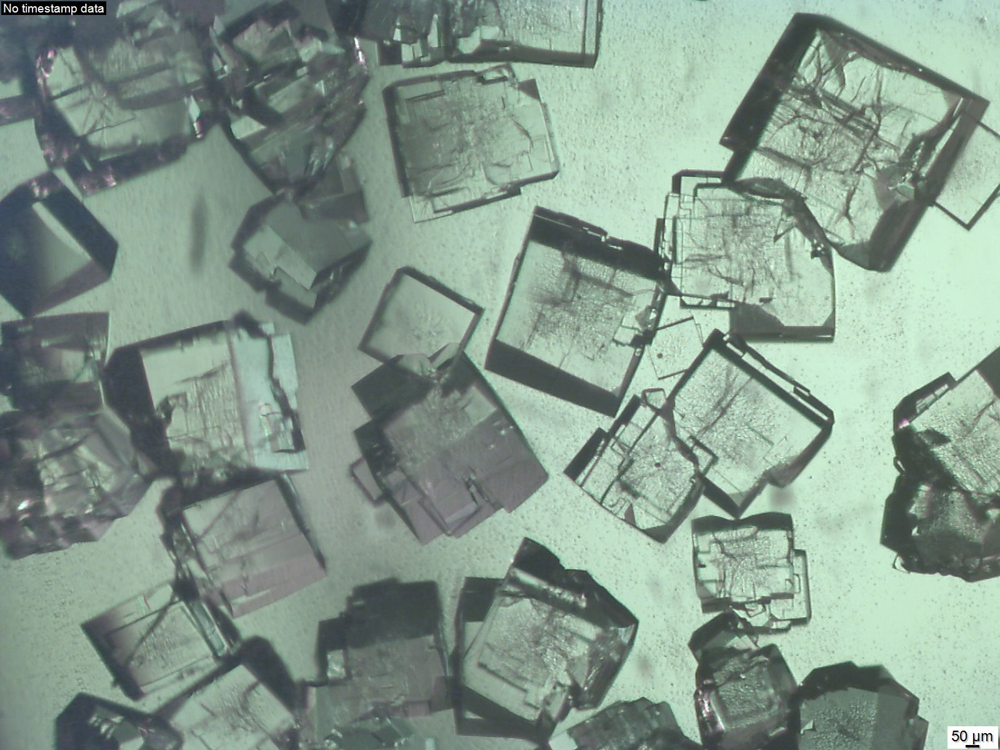
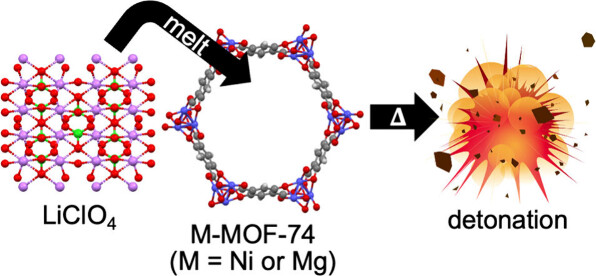
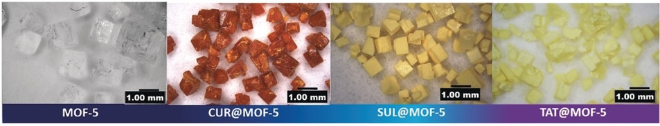
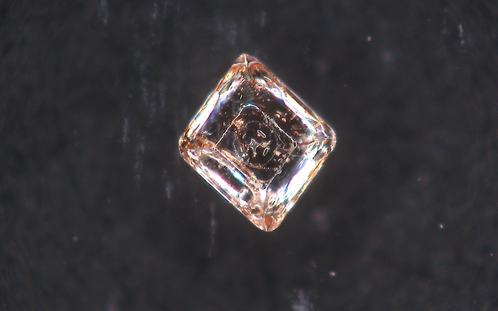
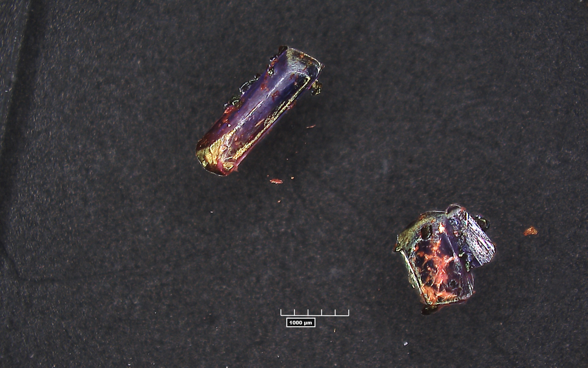
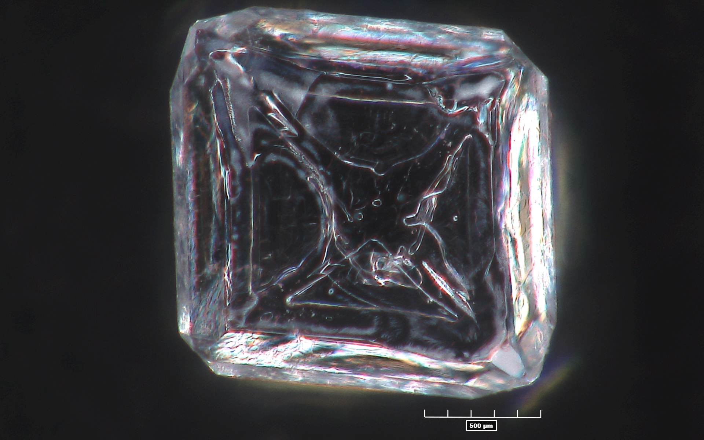
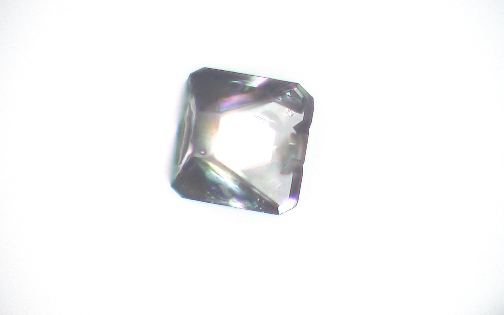
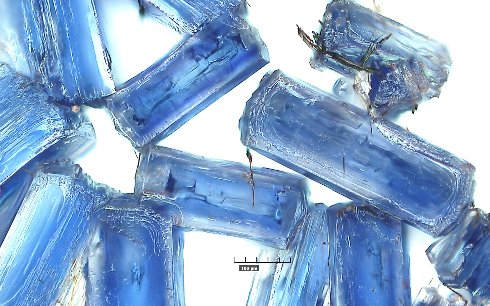

## Research Overview

The Matzger Lab is dedicated to advancing the field of materials chemistry. Our research spans the synthesis and characterization of unique properties for metal–organic frameworks (MOFs), polymorphs, and multicompartment crystallizations. Methodology development is a critical component of many of these efforts and helps push the boundaries of what these materials can achieve. By combining fundamental studies with practical applications such as gas storage, drug delivery, and rational design of energetic materials, we use a broad suite of techniques in a multidisciplinary perspective. Below you will find highlights of specific research projects, illustrating our commitment to unraveling and utilizing the mysteries of materials chemistry. 

Metal–organic frameworks (MOFs) with high levels of porosity are being intensively investigated. New synthetic methods pioneered in the group lead to materials with unprecedented structural properties. Both fundamental studies on processes such as gas adsorption, postsynthetic methods, phase direction, and host-guest chemistry are conducted alongside applications in gas (hydrogen, carbond dioxide, methane) storage and catalysis. Key techniques applied to characterize materials include X-ray diffraction, Raman spectroscopy, scanning electron microscopy, and adsorption analysis.

Desirable properties in energetic materials include high density, thermal stability, low hygroscopicity, and low sensitivity; these properties and others are correlated to the crystalline order of the material in the solid state. Cocrystallization, the combination of two or more compounds in the solid state with a defined order and stoichiometry, affords the opportunity to rationally design novel energetics with improved properties and without the challenges and uncertainty of traditional synthesis pathways. Work in this area is fundamental to understanding how interactions in the solid-state manifest in physical properties and will inform the design of myriad future materials ranging from safer air-bag gas generators to more efficient and environmentally benign rocket boosters.

## Fundamental MOF Studies  
::: {.columns}

::: {.column width="50%"}

*MOF-5 crystals*
:::

::: {.column width="50%"}
.jpg)
*UMCM-152 crystals* 
:::

:::

MOFs are highly porous, crystalline materials whose tunable architectures make them promising platforms for gas storage, drug delivery, and catalysis. As MOF applications continue to expand, a deep understanding of fundamental aspects of MOF formation, activation, and functionalization is essential for rational MOF design.

Our group’s previous work has investigated the kinetics of solvent exchange in both coordinatively unsaturated site (CUS) MOFs and non-CUS MOFs, as well as the importance of water content in the formation of different zinc carboxylate phases. We have also investigated synthesizing MOFs in more environmentally friendly solvents outside of traditional formamides. Although this highlights recent advances in understanding MOF synthesis and activation, the lab has been building a foundation of knowledge for the past two decades.

Current work seeks to understand MOF crystallinity, structure, thermodynamics, and phase using in-situ Raman spectroscopic observations, variable temperature PXRD, TGA-MS, oxygen bomb calorimetry, among other analytical techniques. Through these studies and other future studies, we aim to advance fundamental understandings and discover new strategies for MOF design and application.

## MOF Applications

**Energetic MOFs:**
{width=100%}

*On Demand Ni-MOF 74 Energetic Nanocomposite*

MOFs offer a unique opportunity to study fundamental properties of energetic materials due to their nanoscale mixing of metal catalyst with fuel and oxidizer. This can be achieved either by incorporating energetic linkers into the framework or loading oxidizing content into a nonenergetic MOF. In addition, MOFs have a rigid and repeatable structure, unlike molecular energetics like TNT, CL-20, or HMX, which allows for systematic studies of how special orientation and nanoscale mixing of components within composites affect energetic properties.

Our group has previously investigated the thermal decomposition pathways of Cu-NBO-1 and Cu-NBO-2. Additionally, we have investigated using nonenergetic MOFs to make on-demand energetics by loading these MOFs with non-energetic oxidizing salt (see videos below in the Explosive Composite section). Currently, our work seeks to investigate strategies for catalyzing oxidizing salts to substantially lower oxygen evolution temperatures and synthesizing novel energetic MOFs that serve as model systems for energetic materials.

These studies, among others, aim to leverage MOFs to develop and enhance fundamental understandings of various properties of energetic materials.

**MOFs for Drug Delivery:**
{width=100%}
*Optical images of MOF-5 and drug@MOF-5 composites crystals*

MOFs are increasingly being explored for use in the biomedical field. Their highly porous structures make them promising candidates for applications in sensing, imaging, drug delivery, and drug storage.

MOFs are particularly well-suited for drug delivery due to their high loading capacity, whether through melt loading or solvent-assisted loading. Many drugs, despite being proven effective, cannot be administered because of solubility issues. MOFs can address this challenge by storing pharmaceuticals in an amorphous state within their pores, thereby reducing concerns about drug solubility.

Although MOFs hold significant promise for biomedical applications, improvements in biocompatibility, toxicity, and stability are still needed. Our group has recently shown that you can stabilize the amorphous form of pharmaceuticals in the pores of MOF, resulting in increased solubility in biological media.

We are actively addressing the challenges associated with MOF-based drug delivery by designing MOFs with more biocompatible linkers and metals. Moving forward, our goal is to synthesize biocompatible MOFs that enable access to effective, but otherwise insoluble drugs for clinical administration.

## Energetic Crysals and Cocrystals

::: {.columns}

::: {.column width="50%"}

*Cocrystal of HANN and Urea*
:::

::: {.column width="50%"}

*RDX Crystal*
:::

:::

Lelia will help write this section

## Polymer Applications

Maybe add a little darpa stuff

## Gallery of Crystals 

::: {.columns}

::: {.column width="50%"}

:::

::: {.column width="50%"}

.jpg)
:::

:::

::: {.medium-centered}
*The crystals above are a mix of different Metal-organic Framework (MOF) crystals, energetic materials crystals such as TNT and RDX, and cocrystals.* 
:::

## High-Speed Camera Videos

**Energetic MOF Composite Videos**

::: {.video-grid}

  <video controls>
    <source src="videos/NiIRMOF74II_LP_156b_P3_5fps_playback_S0001.mp4" type="video/mp4">
  </video>
  
NiIRMOF-74 LiClO4 Composite

  <video controls>
    <source src="videos/NiMOF74_LP_156a_P2_5fps_playback_S0001.mp4" type="video/mp4">
  </video>
  
NiMOF-74 Li ClO4 Composite

  <video controls>
    <source src="videos/UMCM74INi_LP_156c_P4_5fps_playback_S0001.mp4" type="video/mp4">
  </video>
  
UMCM-74(Ni) LiClO4 Composite

